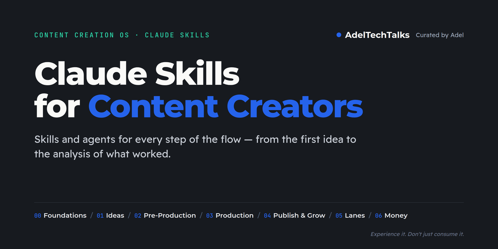
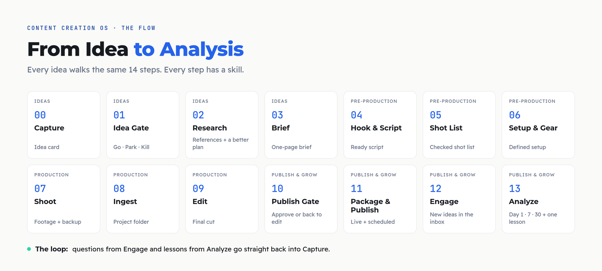

<div align="center">



<br>

[English](README.md) · **العربية**

[](https://github.com/adeltechtalks/Claude-Skills/stargazers)
[](#الـ-skills)
[](#التسطيب)
[](LICENSE)

</div>

<div dir="rtl">

**Claude Skills for Content Creators** هي طبقة الـ Skills والـ Agents بتاعة **Content Creation OS**: System كامل لصناعة المحتوى بالـ AI، من أول ما تبني الـ Brand بتاعك لحد ما تحلل إيه اللي نجح. كل خطوة في الـ Flow ليها [Claude Skill](https://docs.claude.com/en/docs/agents-and-tools/agent-skills/overview) بتشيل الشغل التقيل، وإنت اللي بتاخد كل القرارات.

> [!TIP]
> اعمل **Star** ⭐، و **Watch → Custom → Releases**، عشان يوصلك إشعار مع كل Skill جديدة.

---

## الـ System

</div>



<div dir="rtl">

| الطبقة | بتغطي إيه | بتستخدمها إمتى |
|:--|:--|:--|
| **🧭 Foundations** | الـ Niche، والـ Brand، والـ Studio، والـ Tools، والوقت | مرة واحدة، وترجعلها كل 3 شهور |
| **🔁 The Flow** | 14 خطوة: Ideas و Pre-Production و Production و Publish & Grow | مع كل فكرة |
| **⚡ Lanes** | Fast Track و AI Lane و Live و Events | لما الأسبوع يحتاج محتوى أكتر بمجهود أقل |
| **💰 Monetization** | Affiliate و Brand deals و Media kit | جنب كل حاجة بتنشرها |
| **🤖 [Agents](agents/README.ar.md)** | الـ Content Machine اللي بيمشي معاك في الـ Flow | لما تحب الـ System هو اللي يسوق |

الخريطة الكاملة في **[Content Creation OS](os/README.ar.md)**.

---

## الـ Skills

كل Skill عليها **Free** أو **🔒 Pro**. الـ Free مفتوحة في الريبو ده، والـ Pro جزء من [Content Creation OS Pro](course/README.ar.md).

</div>

<!-- catalog:start -->

<div dir="rtl">

### 🧭 [Foundations](skills/00-foundations/README.ar.md) · التأسيس

حاجات بتتعمل مرة واحدة: الـ Niche، والـ Brand، والـ Studio والـ Tools، والوقت اللي عندك فعلاً.

| الخطوة | الـ Skill | بتعمل إيه | الـ Tier | تحميل |
|:-:|:--|:--|:-:|:-:|
| — | **Niche Compass** | تلاقي الـ Sweet Spot بتاعك وتطلع منه الـ Pillars والـ Positioning. | Free | قريباً |
| — | **Brand Foundations** | نوع الـ Brand، والاسم، والوعد، والـ Voice، وبداية الـ Visual Identity. | Free | قريباً |
| — | **Account Security Audit** | مراجعة أمان خطوة بخطوة للـ Email والـ Domain وكل المنصات. | Free | قريباً |
| — | **Studio Profile** | بتسجل معداتك وأماكن التصوير والـ Apps والمنصات وساعاتك، وكل الـ Skills التانية بتقرا منه. | Free | قريباً |
| — | **Asset Library & License Gate** | شكل الفولدرات، وقواعد التسمية، ومصادر الـ Assets، وسجل الـ Licenses. | 🔒 Pro | قريباً |

### 💡 [Ideas](skills/01-ideas/README.ar.md) · الأفكار

من الفكرة الخام لـ Brief جاهز: تلتقط، وتفلتر، وتدوّر، وتخطط.

| الخطوة | الـ Skill | بتعمل إيه | الـ Tier | تحميل |
|:-:|:--|:--|:-:|:-:|
| 00 | **Idea Capture** | تحوّل Voice note أو Screenshot أو لينك لـ Idea card واضح. | Free | قريباً |
| 01 | **Idea Gate** | أربع أسئلة وقرار Go أو Park أو Kill، ومعاه الـ Angle بتاعك. | Free | قريباً |
| 02 | **Research & Reference** | مين عمل نفس الفكرة، إيه اللي نجح وإيه الناقص، وإزاي تعملها أحسن. | 🔒 Pro | قريباً |
| 03 | **Brief Builder** | Brief في صفحة: الـ Pillar، ونوع المحتوى، والهدف، والـ AI Angle، وخطة المنصات. | 🔒 Pro | قريباً |

### ✍️ [Pre-Production](skills/02-pre-production/README.ar.md) · قبل التصوير

كل حاجة جاهزة قبل ما تدوس Record: الـ Hooks، والـ Script، واللقطات، والـ Setup.

| الخطوة | الـ Skill | بتعمل إيه | الـ Tier | تحميل |
|:-:|:--|:--|:-:|:-:|
| 04 | **Hook & Script Writer** | 3 Hooks، وهيكل Script، و CTA، بصوتك وبلهجتك. | Free | قريباً |
| 05 | **Shot List Builder** | Shot List كاملة (A-roll و B-roll و Hero shots) على حسب نوع المحتوى. | 🔒 Pro | قريباً |
| 06 | **Setup Recipe** | الكاميرا والمايك والإضاءة والمكان، من الـ Studio Profile بتاعك. | 🔒 Pro | قريباً |

### 🎬 [Production](skills/03-production/README.ar.md) · التصوير والمونتاج

تصوّر وتلم الملفات وتعمل Edit بنفس الـ Standard كل مرة.

| الخطوة | الـ Skill | بتعمل إيه | الـ Tier | تحميل |
|:-:|:--|:--|:-:|:-:|
| 08 | **Footage Ingest** | Project folder وتسمية الملفات والـ Backup من كل الأجهزة. | 🔒 Pro | قريباً |
| 09 | **Edit Plan** | Editor brief لقطة بلقطة: القص، والكلام على الشاشة، والـ Motion، والـ SFX، والـ B-roll. | 🔒 Pro | قريباً |
| 09 | **Captions** | Captions و Subtitles مظبوطة بأي لغة. | Free | قريباً |

### 📤 [Publish & Grow](skills/04-publish-grow/README.ar.md) · النشر والنمو

من الـ Final cut للدرس الجاي: مراجعة، وتجهيز، ونشر، وتفاعل، وتحليل.

| الخطوة | الـ Skill | بتعمل إيه | الـ Tier | تحميل |
|:-:|:--|:--|:-:|:-:|
| 10 | **Publish Gate** | مراجعة قبل النشر: اللينكات، والـ Disclosure، والـ Safe zone، والـ Licenses. | Free | قريباً |
| 11 | **[Social Cover Studio](skills/04-publish-grow/social-cover-studio/README.ar.md)** | Covers و Thumbnails بالـ Brand بتاعك من صورة واحدة، بكل المقاسات. | Free | [**⬇ ZIP**](https://github.com/adeltechtalks/Claude-Skills/raw/main/downloads/social-cover-studio.zip) |
| 11 | **Package & Publish** | Caption و Hashtags ومواعيد لكل منصة من نفس الـ Brief. | 🔒 Pro | قريباً |
| 12 | **Engage Inbox** | يلم الأسئلة المتكررة من الكومنتات والـ DMs ويحوّلها أفكار. | 🔒 Pro | قريباً |
| 13 | **Analyze & Monthly Review** | أرقام يوم 1 و 7 و 30، ودرس واحد لكل بوست، ومراجعة شهرية. | 🔒 Pro | قريباً |

### ⚡ [Lanes](skills/05-lanes/README.ar.md) · المسارات

تنشر أكتر بمجهود أقل: الأخبار المستعجلة، وبوستات الـ AI Lane، والـ Live، والمؤتمرات.

| الخطوة | الـ Skill | بتعمل إيه | الـ Tier | تحميل |
|:-:|:--|:--|:-:|:-:|
| — | **Fast Track** | خبر أو Launch يتنشر خلال 48 ساعة من غير ما يبوّظ أسبوعك. | Free | قريباً |
| — | **AI Lane** | الـ AI بيدوّر ويكتب ويصمم، وإنت تراجع وتوافق. | 🔒 Pro | قريباً |
| — | **Event Lane** | تغطية المؤتمرات والـ Events في دقايق. | 🔒 Pro | قريباً |

### 💰 [Monetization](skills/06-monetization/README.ar.md) · الفلوس

كل محتوى بيجيب فلوس منين: الـ Affiliate، والـ Brand deals، والـ Media kit.

| الخطوة | الـ Skill | بتعمل إيه | الـ Tier | تحميل |
|:-:|:--|:--|:-:|:-:|
| — | **Affiliate Tracker** | تتابع اللينكات والكليكات والأرباح لكل منتج وبوست. | Free | قريباً |
| — | **Media Kit** | Media kit احترافي من أرقامك الحقيقية. | 🔒 Pro | قريباً |
| — | **Brand Deal Desk** | تقيّم الـ Brand deals وتسعّرها وترد عليها، وتكشف الـ Scams. | 🔒 Pro | قريباً |

</div>

<!-- catalog:end -->

<div dir="rtl">

محتاج Skill معينة في شغلك؟ [اطلبها من هنا](https://github.com/adeltechtalks/Claude-Skills/issues/new).

---

## التسطيب

### على Claude.ai (Web أو Desktop أو Mobile)

1. حمّل ملف الـ **ZIP** بتاع الـ Skill من الجدول فوق.
2. في Claude روح لـ **Settings → Capabilities**، وشغّل **Code execution and file creation**.
3. روح لـ **Customize → Skills**، ودوس **+**، وارفع ملف الـ ZIP زي ما هو، **من غير ما تفكه**.

الـ Skills شغالة على كل خطط Claude. ولو إنت على Team أو Enterprise، الأدمن لازم يكون مفعّل Skills للمؤسسة.

### على Claude Code

</div>

```bash
/plugin marketplace add adeltechtalks/Claude-Skills
/plugin install publish-grow-skills@adeltechtalks-skills
```

<div dir="rtl">

أو انسخ فولدر الـ Skill نفسه (مثلاً `skills/04-publish-grow/social-cover-studio`) جوه `~/.claude/skills/`.

---

## المبادئ

- **الـ AI يقترح، وإنت تقرر.** مفيش حاجة بتتنشر أو بتتبعت من غير موافقتك.
- **الحقيقي قبل المتولّد.** صور حقيقية، وتجارب حقيقية، وأرقام حقيقية. الـ AI بيسد فجوة، مش بيزيّف نتيجة.
- **مصدر واحد، وفورماتات كتير.** بتكتبها مرة واحدة، وكل منصة بتاخد النسخة بتاعتها.
- **بنراجع قبل ما ننشر.** أي معلومة عن الأدوات والمنصات بتتراجع من المصادر الرسمية.

---

## المساهمة

كل Skill جديدة بتمشي على القالب اللي في [`templates/skill-template`](templates/skill-template/). والخطوات كلها في [CONTRIBUTING.md](CONTRIBUTING.md).

## License

الـ Free Skills متاحة بـ [MIT License](LICENSE). ومحتوى الـ Pro ليه License منفصل.

</div>

<div align="center">
<br>
<sub><b>AdelTechTalks</b> · Curated by Adel · <i>Experience it. Don't just consume it.</i></sub>
<br>
<sub><a href="https://instagram.com/adeltechtalks">Instagram</a> · <a href="https://adeltechtalks.com">adeltechtalks.com</a></sub>
</div>
