<p align="center"><a href="README.md"></a>&nbsp;&nbsp;<a href="README.ar.md"></a></p>

<div align="center">


<br>

<p dir="rtl"><b><a href="https://docs.claude.com/en/docs/agents-and-tools/agent-skills/overview">Claude Skills</a> مجانية وجاهزة لكل خطوة في صناعة المحتوى: من أول فكرة لحد تحليل اللي نجح.</b></p>

<br>

<a href="skills/README.ar.md"></a>&nbsp;&nbsp;<a href="#install"></a>&nbsp;&nbsp;<a href="https://github.com/adeltechtalks/AdelTechTalks-Claude/stargazers"></a>

<br>

[](https://github.com/adeltechtalks/AdelTechTalks-Claude/stargazers)
[](skills/README.ar.md)
[](#install)
[](LICENSE)

</div>

---

<div dir="rtl">

## متاحة دلوقتي

</div>

<!-- featured:start -->

<a href="skills/04-publish-grow/social-cover-studio/README.ar.md"></a>

<p align="center"><a href="https://github.com/adeltechtalks/AdelTechTalks-Claude/raw/main/downloads/social-cover-studio.zip"></a>&nbsp;&nbsp;<a href="skills/04-publish-grow/social-cover-studio/README.ar.md"></a></p>

<!-- featured:end -->

---

<div dir="rtl">

## الـ System

كل فكرة بتمشي في نفس الـ 14 خطوة، وكل خطوة ليها Skill. الـ Foundations بتتعمل مرة واحدة، والـ Lanes والـ Monetization شغالين جنب الـ Flow. **[اقرا الـ Method كامل ←](os/README.ar.md)**

</div>


---

<div dir="rtl">

## الـ Skills حسب المرحلة

دوس على أي مرحلة عشان تشوف الـ Skills بتاعتها. الـ **Free** مفتوحة في الريبو ده، والـ **🔒 Pro** جزء من [Content Creation OS Pro](course/README.ar.md). **[شوف كل الـ Skills في لستة واحدة ←](skills/README.ar.md)**

</div>

<!-- stages:start -->

<div dir="rtl">

<table>
<tr>
<td width="50%"><a href="skills/00-foundations/README.ar.md"></a></td>
<td width="50%"><a href="skills/01-ideas/README.ar.md"></a></td>
</tr>
<tr>
<td width="50%"><a href="skills/02-pre-production/README.ar.md"></a></td>
<td width="50%"><a href="skills/03-production/README.ar.md"></a></td>
</tr>
<tr>
<td width="50%"><a href="skills/04-publish-grow/README.ar.md"></a></td>
<td width="50%"><a href="skills/05-lanes/README.ar.md"></a></td>
</tr>
<tr>
<td width="50%"><a href="skills/06-monetization/README.ar.md"></a></td>
<td width="50%"></td>
</tr>
</table>

</div>

<!-- stages:end -->

---

<a id="install"></a>

<div dir="rtl">

## التسطيب

</div>


<div dir="rtl">

<sub>شغالة على كل خطط Claude. ولو إنت على Team أو Enterprise، الأدمن لازم يفعّل الـ Skills الأول.</sub>

**بتستخدم Claude Code؟**

</div>

```bash
/plugin marketplace add adeltechtalks/AdelTechTalks-Claude
/plugin install publish-grow-skills@adeltechtalks-claude
```

---

<div dir="rtl">

## المبادئ

</div>


---

<div dir="rtl">

<details>
<summary><b>🤖 الـ Agents: الـ Content Machine</b></summary>

<br>

كل Skill بتعمل حاجة واحدة. الـ **Content Machine** بيربطهم ببعض وبيمشي معاك في الـ Flow كله: بيقترح في كل خطوة، وإنت اللي بتوافق. لسه في مرحلة التصميم، وهينزل مع [Content Creation OS Pro](course/README.ar.md). **[شوف الـ Agent Map ←](agents/README.ar.md)**

</details>

<details>
<summary><b>📁 شكل الريبو</b></summary>

<br>

</div>

```
os/                               الـ Content Creation OS: الـ Method اللي ورا الـ Skills
skills/<المرحلة>/<الـ-skill>/       الـ Free Skills مترتبة بالمراحل
agents/                           الـ Content Machine والـ Agent map
course/                           مسار التعلم والـ Pro
docs/                             الصور والأدلة (بتتعمل بـ scripts/build-art.py)
downloads/<الـ-skill>.zip          ملفات الـ ZIP الجاهزة (scripts/build-zips.sh)
catalog.json                      مصدر كل الـ Skills (scripts/build-catalog.py)
templates/skill-template/         قالب أي Skill جديدة
.claude-plugin/marketplace.json   للتسطيب من Claude Code
```

<div dir="rtl">

</details>

<details>
<summary><b>🛠 المساهمة</b></summary>

<br>

كل Skill جديدة بتمشي على القالب اللي في [`templates/skill-template`](templates/skill-template/)، والخطوات كلها في [CONTRIBUTING.md](CONTRIBUTING.md).

</details>

</div>

---

<div align="center">
<sub>الـ Free Skills متاحة بـ <a href="LICENSE">MIT License</a> · ومحتوى الـ Pro ليه License منفصل</sub>
<br><br>
<sub><b>AdelTechTalks</b> · Curated by Adel · <i>Experience it. Don't just consume it.</i></sub>
<br>
<sub><a href="https://instagram.com/adeltechtalks">Instagram</a> · <a href="https://adeltechtalks.com">adeltechtalks.com</a></sub>
</div>
