<p align="center"><a href="README.md"></a>&nbsp;&nbsp;<a href="README.ar.md"></a></p>

<div align="center">


<br>

**Free, ready-to-use [Claude Skills](https://docs.claude.com/en/docs/agents-and-tools/agent-skills/overview) for every step of content creation — from the first idea to the analysis of what worked.**

<br>

<a href="skills/"></a>&nbsp;&nbsp;<a href="#install"></a>&nbsp;&nbsp;<a href="https://github.com/adeltechtalks/AdelTechTalks-Claude/stargazers"></a>

<br>

[](https://github.com/adeltechtalks/AdelTechTalks-Claude/stargazers)
[](skills/)
[](#install)
[](LICENSE)

</div>

---

## Available now

<!-- featured:start -->

<table>
<tr>
<td width="50%" valign="top"><a href="skills/04-publish-grow/social-cover-studio/"></a><p align="center"><a href="https://github.com/adeltechtalks/AdelTechTalks-Claude/raw/main/downloads/social-cover-studio.zip"></a>&nbsp;<a href="skills/04-publish-grow/social-cover-studio/"></a></p></td>
<td width="50%" valign="top"><a href="https://github.com/adeltechtalks/AdelTechTalks-Claude/subscription"></a><p align="center"><a href="https://github.com/adeltechtalks/AdelTechTalks-Claude/subscription"></a></p></td>
</tr>
</table>

<!-- featured:end -->

---

## The system

Every idea walks the same 14 steps — and every step gets a skill. Foundations are set once; Lanes and Monetization run alongside. **[Read the full method →](os/)**


---

## Skills by stage

Tap a stage to see its skills. **Free** skills are open in this repo; **🔒 Pro** skills ship with [Content Creation OS Pro](course/). **[See all skills in one list →](skills/)**

<!-- stages:start -->

<table>
<tr>
<td width="50%"><a href="skills/00-foundations/"></a></td>
<td width="50%"><a href="skills/01-ideas/"></a></td>
</tr>
<tr>
<td width="50%"><a href="skills/02-pre-production/"></a></td>
<td width="50%"><a href="skills/03-production/"></a></td>
</tr>
<tr>
<td width="50%"><a href="skills/04-publish-grow/"></a></td>
<td width="50%"><a href="skills/05-lanes/"></a></td>
</tr>
<tr>
<td width="50%"><a href="skills/06-monetization/"></a></td>
<td width="50%"></td>
</tr>
</table>

<!-- stages:end -->

---

<a id="install"></a>

## Install



<sub>Works on every Claude plan. On Team and Enterprise, an admin must enable Skills first.</sub>

**Using Claude Code?**

```bash
/plugin marketplace add adeltechtalks/AdelTechTalks-Claude
/plugin install publish-grow-skills@adeltechtalks-claude
```

---

## Principles



---

<details>
<summary><b>🤖 Agents — the Content Machine</b></summary>

<br>

Skills do one job each. The **Content Machine** agent chains them and walks the whole flow with you — suggesting at every step while you approve. It's in design and will ship with [Content Creation OS Pro](course/). **[See the agent map →](agents/)**

</details>

<details>
<summary><b>📁 Repository structure</b></summary>

<br>

```
os/                               The Content Creation OS — the method behind the skills
skills/<stage>/<skill>/           Free skills, grouped by stage
agents/                           The Content Machine and the agent map
course/                           Learning path and Pro access
docs/                             Images and guides (art built by scripts/build-art.py)
downloads/<skill>.zip             Ready-to-upload ZIPs (scripts/build-zips.sh)
catalog.json                      Single source of truth for the catalog (scripts/build-catalog.py)
templates/skill-template/         Starting point for a new skill
.claude-plugin/marketplace.json   Claude Code plugin marketplace
```

</details>

<details>
<summary><b>🛠 Contributing</b></summary>

<br>

New skills follow [`templates/skill-template`](templates/skill-template/). The full checklist is in [CONTRIBUTING.md](CONTRIBUTING.md).

</details>

---

<div align="center">
<sub>Free skills are released under the <a href="LICENSE">MIT License</a> · Pro content is licensed separately</sub>
<br><br>
<sub><b>AdelTechTalks</b> · Curated by Adel · <i>Experience it. Don't just consume it.</i></sub>
<br>
<sub><a href="https://instagram.com/adeltechtalks">Instagram</a> · <a href="https://adeltechtalks.com">adeltechtalks.com</a></sub>
</div>
