<div align="center">



<br>

**English** · [العربية](README.ar.md)

[](https://github.com/adeltechtalks/AdelTechTalks-Claude/stargazers)
[](#skills)
[](#installation)
[](LICENSE)

</div>

**Claude Skills for Content Creators** is the skills-and-agents layer of the **Content Creation OS** — a complete system for creating content with AI, from setting up your brand to analysing what worked. Every step of the flow has a [Claude Skill](https://docs.claude.com/en/docs/agents-and-tools/agent-skills/overview) that does the heavy lifting, while you stay in charge of every decision.

> [!TIP]
> **Star** ⭐ and **Watch → Custom → Releases** to get notified whenever a new skill ships.

---

## The system


| Layer | What it covers | When you use it |
|:--|:--|:--|
| **🧭 Foundations** | Niche, brand, studio, tools, time | Once — then revisit every 3 months |
| **🔁 The Flow** | 14 steps across Ideas · Pre-Production · Production · Publish & Grow | For every single idea |
| **⚡ Lanes** | Fast Track · AI Lane · Live · Events | When the week needs more with less |
| **💰 Monetization** | Affiliates · Brand deals · Media kit | Alongside everything you publish |
| **🤖 [Agents](agents/)** | The Content Machine that runs the flow with you | When you want the system to drive |

Read the full map in **[The Content Creation OS](os/)**.

---

## Skills

Each skill is tagged **Free** or **🔒 Pro**. Free skills are open source in this repo. Pro skills ship with [Content Creation OS Pro](course/).

<!-- catalog:start -->

### 🧭 [Foundations](skills/00-foundations/)

One-time setup: your niche, your brand, your studio and tools, and the time you actually have.

| Step | Skill | What it does | Tier | Get it |
|:-:|:--|:--|:-:|:-:|
| — | **Niche Compass** | Find your sweet spot and turn it into content pillars and a one-line positioning. | Free | Soon |
| — | **Brand Foundations** | Brand type, name check, promise, voice and a starter visual identity. | Free | Soon |
| — | **Account Security Audit** | Step-by-step security check for your email, domain and every platform. | Free | Soon |
| — | **Studio Profile** | Capture your gear, locations, apps, platforms and weekly hours — the profile every other skill reads. | Free | Soon |
| — | **Asset Library & License Gate** | Folder tree, naming rules, asset sources and a license log so nothing gets muted or claimed. | 🔒 Pro | Soon |

### 💡 [Ideas](skills/01-ideas/)

From a raw thought to a ready brief: capture, filter, research, plan.

| Step | Skill | What it does | Tier | Get it |
|:-:|:--|:--|:-:|:-:|
| 00 | **Idea Capture** | Turn a voice note, screenshot or link into a clean idea card. | Free | Soon |
| 01 | **Idea Gate** | Four questions — niche, need, payoff, timing — and a Go / Park / Kill decision with your angle. | Free | Soon |
| 02 | **Research & Reference** | Find who already made it, what worked, what's missing — and how yours will be better. | 🔒 Pro | Soon |
| 03 | **Brief Builder** | One-page brief: pillar, content type, goal, AI angle and channel plan. | 🔒 Pro | Soon |

### ✍️ [Pre-Production](skills/02-pre-production/)

Everything ready before you hit record: hooks, script, shots and setup.

| Step | Skill | What it does | Tier | Get it |
|:-:|:--|:--|:-:|:-:|
| 04 | **Hook & Script Writer** | Three hooks, a script structure and a CTA — in your own voice and dialect. | Free | Soon |
| 05 | **Shot List Builder** | A-roll, B-roll and hero shots generated from the content type. | 🔒 Pro | Soon |
| 06 | **Setup Recipe** | Camera, mic, lighting and location picked from your Studio Profile. | 🔒 Pro | Soon |

### 🎬 [Production](skills/03-production/)

Shoot, ingest and edit with the same standard every time.

| Step | Skill | What it does | Tier | Get it |
|:-:|:--|:--|:-:|:-:|
| 08 | **Footage Ingest** | Project folder, file naming and backup checklist from every device. | 🔒 Pro | Soon |
| 09 | **Edit Plan** | A beat-by-beat editor brief: cuts, on-screen text, motion, SFX and B-roll. | 🔒 Pro | Soon |
| 09 | **Captions** | Clean, correctly shaped captions and subtitles in any language. | Free | Soon |

### 📤 [Publish & Grow](skills/04-publish-grow/)

From final cut to the next lesson: review, package, publish, engage, analyze.

| Step | Skill | What it does | Tier | Get it |
|:-:|:--|:--|:-:|:-:|
| 10 | **Publish Gate** | Pre-publish check: links, disclosure, safe zones and licenses. | Free | Soon |
| 11 | **[Social Cover Studio](skills/04-publish-grow/social-cover-studio/)** | Branded covers and thumbnails from a single photo, exported for every platform. | Free | [**⬇ ZIP**](https://github.com/adeltechtalks/AdelTechTalks-Claude/raw/main/downloads/social-cover-studio.zip) |
| 11 | **Package & Publish** | Captions, hashtags and schedule for each platform from one brief. | 🔒 Pro | Soon |
| 12 | **Engage Inbox** | Group repeated questions from comments and DMs into new ideas. | 🔒 Pro | Soon |
| 13 | **Analyze & Monthly Review** | Day 1 · 7 · 30 numbers, one lesson per post and a monthly review. | 🔒 Pro | Soon |

### ⚡ [Lanes](skills/05-lanes/)

Publish more with less effort: fast news, AI-assisted posts, lives and events.

| Step | Skill | What it does | Tier | Get it |
|:-:|:--|:--|:-:|:-:|
| — | **Fast Track** | Breaking news or a launch live within 48 hours — without breaking your week. | Free | Soon |
| — | **AI Lane** | AI researches, writes and designs; you review and approve. | 🔒 Pro | Soon |
| — | **Event Lane** | Conference and launch-event coverage in minutes. | 🔒 Pro | Soon |

### 💰 [Monetization](skills/06-monetization/)

Where every piece of content makes money: affiliates, brand deals and your media kit.

| Step | Skill | What it does | Tier | Get it |
|:-:|:--|:--|:-:|:-:|
| — | **Affiliate Tracker** | Track links, clicks and earnings per product and post. | Free | Soon |
| — | **Media Kit** | A professional media kit built from your real numbers. | 🔒 Pro | Soon |
| — | **Brand Deal Desk** | Qualify, price and reply to brand deals — and spot scams. | 🔒 Pro | Soon |

<!-- catalog:end -->

Missing a skill in your workflow? [Request it](https://github.com/adeltechtalks/AdelTechTalks-Claude/issues/new).

---

## Installation

### Claude.ai — web, desktop and mobile

1. Download the skill's **ZIP** from the catalog above.
2. In Claude, open **Settings → Capabilities** and turn on **Code execution and file creation**.
3. Go to **Customize → Skills**, click **+**, and upload the ZIP as it is — **don't unzip it**.

Skills are available on all Claude plans. On Team and Enterprise, an admin must enable Skills for the organization.

### Claude Code

```bash
/plugin marketplace add adeltechtalks/AdelTechTalks-Claude
/plugin install publish-grow-skills@adeltechtalks-claude
```

Or copy a skill folder (for example `skills/04-publish-grow/social-cover-studio`) into `~/.claude/skills/`.

---

## Principles

- **The AI suggests, you decide.** Nothing is published or sent without your approval.
- **Real over generated.** Real photos, real tests, real numbers — AI fills gaps, it doesn't fake results.
- **One source, many formats.** Write it once; every platform gets its own cut.
- **Verified before published.** Facts about tools and platforms are checked against official sources.

---

## Repository structure

```
os/                               The Content Creation OS — the method behind the skills
skills/<stage>/<skill>/           Free skills, grouped by stage (SKILL.md + scripts + assets + pages)
agents/                           The Content Machine and the agent map
course/                           Learning path and Pro access
docs/                             Images and guides (animated art built by scripts/build-art.py)
downloads/<skill>.zip             Ready-to-upload ZIPs (scripts/build-zips.sh)
catalog.json                      Single source of truth for the catalog (scripts/build-catalog.py)
templates/skill-template/         Starting point for a new skill
.claude-plugin/marketplace.json   Claude Code plugin marketplace
```

## Contributing

New skills follow [`templates/skill-template`](templates/skill-template/). See [CONTRIBUTING.md](CONTRIBUTING.md).

## License

Free skills are released under the [MIT License](LICENSE). Pro content is licensed separately.

<div align="center">
<br>
<sub><b>AdelTechTalks</b> · Curated by Adel · <i>Experience it. Don't just consume it.</i></sub>
<br>
<sub><a href="https://instagram.com/adeltechtalks">Instagram</a> · <a href="https://adeltechtalks.com">adeltechtalks.com</a></sub>
</div>
