# 🧭 Content Creation OS

[← كل الـ Skills](../README.ar.md) · [English](README.md) · **العربية**

الـ Content Creation OS هو الـ Method اللي ورا كل Skill في الريبو ده. بيحوّل صناعة المحتوى من قرارات كتير كل يوم لـ System واحد: **تقرر مرة واحدة، وكل فكرة بتمشي في نفس الطريق.**

وهو جزئين.

---

## الكتاب الأول · Get Started: بيتعمل مرة واحدة

الأساس اللي بتبنيه قبل أول فكرة، وبترجعله كل 3 شهور.

| الجزء | بيغطي إيه | النتيجة |
|:--|:--|:--|
| **01 · Niche** | بتعرف إيه، وبتحب إيه، والناس محتاجة إيه، وهتكسب منين | الـ Pillars والـ Positioning |
| **02 · Brand** | نوع الـ Brand، والـ Domain والـ Handles، وتأمين الحسابات، والـ Voice والـ Visual Identity، والـ Signature Style، والـ Launch | Brand متسق ومتأمن على كل المنصات |
| **03 · Studio, Kit & Tools** | الـ Tools لكل مرحلة، والـ Analytics Hub، والتصوير والألوان، والفونتات والصوت والـ Motion، والـ Asset Library، والـ Licenses | نفس الجودة كل مرة، ومن غير مشاكل Copyright |
| **04 · Time & Gear** | الـ Time Blocks، والـ Gadget Inventory، والـ Product Cards، والاشتراكات | أسبوع واقعي، وخطة لكل منتج |

← الـ Skills: [**00 · Foundations**](../skills/00-foundations/README.ar.md)

---

## الكتاب التاني · From Idea to Analysis: مع كل فكرة

| الجزء | الخطوات | النتيجة | الـ Skills |
|:--|:--|:--|:--|
| **01 · Ideas** | Capture ← Idea Gate ← Research ← Brief | من 3 لـ 5 أفكار Go كل أسبوع، وكل واحدة ليها Brief | [01-ideas](../skills/01-ideas/README.ar.md) |
| **02 · Pre-Production** | Hook & Script ← Shot List ← Setup & Gear | كل حاجة جاهزة قبل ما تدوس Record | [02-pre-production](../skills/02-pre-production/README.ar.md) |
| **03 · Production** | Shoot ← Ingest ← Edit | الـ Final cut | [03-production](../skills/03-production/README.ar.md) |
| **04 · Publish & Grow** | Publish Gate ← Package & Publish ← Engage ← Analyze | بوستات منشورة، ودرس واحد للـ Brief الجاي | [04-publish-grow](../skills/04-publish-grow/README.ar.md) |
| **05 · Lanes** | Fast Track و AI Lane و Live Track و Event Lane | محتوى ثابت حتى في الأسابيع المشغولة | [05-lanes](../skills/05-lanes/README.ar.md) |
| **06 · Monetization** | Monetization map و Affiliate tracker و Brand tracker و Media kit | كل محتوى عارف بيجيب فلوس منين | [06-monetization](../skills/06-monetization/README.ar.md) |
| **07 · Reference** | Events calendar و Channel matrix و Video sizes و Agent map | صفحات بترجعلها وقت ما تحتاج | [agents](../agents/README.ar.md) |

### الإيقاع الأسبوعي

| الاتنين | التلات | الأربع | الخميس | الجمعة | السبت | الحد |
|:--|:--|:--|:--|:--|:--|:--|
| Idea Gate و Research و Brief | Script و Shot list و AI Lane | Setup و Shoot | Ingest و Edit | Publish و Engage | Batch shoot أو Live | Analyze و Reels و Flex |

### الـ Idea Gate

كل فكرة لازم تجاوب على 4 أسئلة قبل ما تاخد من وقتك:

1. **مجالي:** الفكرة في مجالي؟
2. **احتياج:** مين محتاجها؟ عايز يفهم، ولا يعمل، ولا يختار، ولا يعرف الجديد، ولا يتحمس؟
3. **فايدة:** Affiliate، ولا Course، ولا Consulting، ولا زكاة علم؟
4. **توقيت:** Trending، ولا Evergreen، ولا موسم، ولا Launch؟

**Go** = الأربعة ومعاهم Angle واضح · **Park** = 3، أو لسه مفيش Angle · **Kill** = اتنين أو أقل.

---

> 📘 الـ Workbooks الكاملة للكتاب الأول والتاني، جاهزة للطباعة، جزء من [Content Creation OS Pro](../course/README.ar.md).

