&nbsp;&nbsp;

# 🧭 The Content Creation OS

[← All skills](../README.md)

The Content Creation OS is the method behind every skill in this repo. It turns content creation from a pile of daily decisions into one system: **decide once, then let every idea walk the same path.**

It has two parts.

---

## Book 1 · Get Started — *done once*

Set up the foundations before your first idea. Revisit every three months.

| Part | Covers | Output |
|:--|:--|:--|
| **01 · Niche** | What you know, what you love, what people need, how you'll earn | Pillars + positioning |
| **02 · Brand** | Brand type, domain & handles, account security, voice & visual identity, signature style, launch | A consistent, secure brand on every platform |
| **03 · Studio, Kit & Tools** | Tools per stage, analytics hub, shooting format & colour, fonts, sound & motion, asset library, licenses | Same quality every time — and no copyright issues |
| **04 · Time & Gear** | Time blocks & capacity, gadget inventory, product cards, subscriptions | A realistic week and a plan for every product |

→ Skills: [**00 · Foundations**](../skills/00-foundations/)

---

## Book 2 · From Idea to Analysis — *every idea*

| Part | Steps | Output | Skills |
|:--|:--|:--|:--|
| **01 · Ideas** | Capture → Idea Gate → Research → Brief | 3–5 *Go* ideas a week, each with a brief | [01-ideas](../skills/01-ideas/) |
| **02 · Pre-Production** | Hook & Script → Shot List → Setup & Gear | Everything ready before you hit record | [02-pre-production](../skills/02-pre-production/) |
| **03 · Production** | Shoot → Ingest → Edit | Final cut | [03-production](../skills/03-production/) |
| **04 · Publish & Grow** | Publish Gate → Package & Publish → Engage → Analyze | Live posts and one lesson for the next brief | [04-publish-grow](../skills/04-publish-grow/) |
| **05 · Lanes** | Fast Track · AI Lane · Live Track · Event Lane | Consistent output, even in busy weeks | [05-lanes](../skills/05-lanes/) |
| **06 · Monetization** | Monetization map · Affiliate tracker · Brand tracker & media kit | Every piece of content knows how it earns | [06-monetization](../skills/06-monetization/) |
| **07 · Reference** | Events calendar · Channel matrix · Video sizes · Agent map | Pages you come back to | [agents](../agents/) |

### The weekly rhythm

| Mon | Tue | Wed | Thu | Fri | Sat | Sun |
|:--|:--|:--|:--|:--|:--|:--|
| Idea Gate · Research · Brief | Script · Shot list · AI Lane | Setup · Shoot | Ingest · Edit | Publish · Engage | Batch shoot or Live | Analyze · Reels · Flex |

### The Idea Gate

Every idea answers four questions before it takes any of your time:

1. **Niche** — is it in my space?
2. **Need** — who needs it: to *learn*, *do*, *decide*, *stay updated* or *get inspired*?
3. **Payoff** — affiliate, course, consulting, or knowledge shared for free?
4. **Timing** — trending, evergreen, seasonal or a launch?

**Go** = all four + a clear angle · **Park** = three, or no angle yet · **Kill** = two or fewer.

---

> [!NOTE]
> The full printable workbooks for Book 1 and Book 2 are part of [Content Creation OS Pro](../course/).
