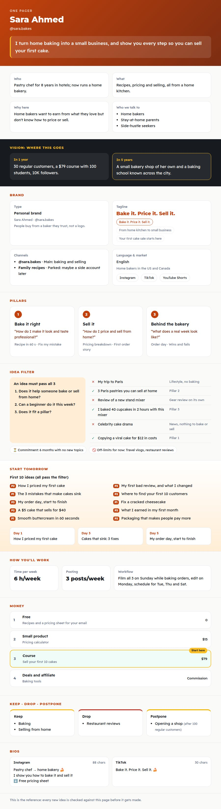

<p align="center"><a href="README.md"></a>&nbsp;&nbsp;<a href="README.ar.md"></a></p>

<div align="center">



<p dir="rtl"><a href="../../../README.ar.md">→ كل الـ Skills</a> · <a href="../README.ar.md">التأسيس</a></p>

<br>

<a href="https://github.com/adeltechtalks/AdelTechTalks-Claude/raw/main/downloads/niche-compass.zip"></a>

</div>

<div dir="rtl">

<br>

> [!NOTE]
> 🧪 **تجريبية.** شغالة من أولها لآخرها، جرّبها وقولنا لو حاجة باظت.

| بتدّيه | بتاخد | الجولات | شغالة على |
|:--|:--|:-:|:--|
| حوالي 20 دقيقة إجابات | الـ **Foundations** بتاعتك في صفحة متصمّمة (HTML و PDF): الرؤية، والبراند والـ Tagline، والـ Pillars، والفلتر، ووقتك، و10 أفكار | **8** | Claude.ai و Claude Code |

---

## بتشتغل إزاي

</div>



<div dir="rtl">

---

## الـ One Pager بتاعك

</div>



<div dir="rtl">

<sub>مثال اتعمل بالـ Skill لصاحبة مخبز من البيت (شخصية خيالية)، بألوان البراند بتاعتها.</sub>

| الجزء | بيجاوب على |
|:--|:--|
| مين · بيعمل إيه · ليه · بيكلّم مين | انت مين، وبتعمل إيه، وموجود ليه، وجمهورك مين |
| الرؤية | عايز توصل لفين بعد سنة وبعد 5 سنين |
| البراند | اسمك الشخصي ولا براند، والـ Handle، واختيارات الـ Tagline، والقنوات، والمنصات، واللغة والسوق |
| 3 Pillars | المواضيع الوحيدة اللي بتنشر عنها، وأنواع المحتوى في كل واحد |
| فلتر الأفكار | 3 أسئلة أيوه أو لأ، وأمثلة من مجالك: ✕ مش بتاعنا، و✓ نفس الموضوع بزاوية صح |
| **ابدأ بكرة** | 10 أفكار عدّت على الفلتر، وأول 3 بوستات بالترتيب |
| هتشتغل إزاي | وقتك في الأسبوع، وكام بوست تقدر تكمّل عليهم، والبوست بيتعمل إزاي |
| الفلوس | سلّم من ببلاش لحد الخدمة، والدرجة اللي تبدأ بيها |
| هتكمّل · هتسيب · هتأجّل | اللي ضحّيت بيه، وإمتى ترجع تبص عليه |
| الـ Bios | Instagram وTikTok وX وLinkedIn، محسوبة على حد كل منصة |

---

## ابدأ

### 1 · Install: مرة واحدة، 5 دقايق

</div>

<a href="https://github.com/adeltechtalks/AdelTechTalks-Claude/raw/main/downloads/niche-compass.zip"></a>

<div dir="rtl">

<sub>دوس على الصورة عشان تحمّل · Settings → Capabilities → **Code execution and file creation** · Customize → Skills → **+** → ارفع الـ ZIP زي ما هو.</sub>

### 2 · ابدأ الـ Interview

</div>

```
استخدم niche-compass. أنا تايه ومش عارف أعمل محتوى عن إيه. اعملي Interview وطلّعلي الـ One Pager بتاعي.
```

<div dir="rtl">

عندك بروفايل؟ ابعت Screenshot منه، والـ Skill هيحافظ على شكل الـ Bio بتاعك ويستخدم أرقامك كدليل.

### 3 · استخدمه كل يوم

حط `one-pager.json` (أو الـ PDF) في الـ Knowledge بتاع الـ Claude Project. وبعدين مع أي فكرة جديدة:

</div>

```
قارن الفكرة دي بالـ One Pager بتاعي: [الفكرة]
```

<div dir="rtl">

| الملف | النوع | بيتستخدم في |
|:--|:--|:--|
| `one-pager.html` | صفحة ويب | تفتحها على الموبايل، أو تشاركها، أو تطبعها |
| `one-pager.pdf` | PDF | تحتفظ بيه، أو تطبعه، أو تحطه في Project |
| `one-pager.json` | بيانات | المرجع اللي كل الـ Skills التانية بتقرا منه |

---

<details>
<summary><b>نصايح</b></summary>

<br>

- جاوب بصراحة في الجولة 6 و7 (الرؤية والحسم). هناك الـ Niche بيبان.
- الحاجة اللي بتحبها مش لازم تبقى Pillar. ممكن تفضل هواية، أو حساب جانبي، أو بيزنس بعدين.
- شغّل الـ Skill تاني بعد أي تغيير كبير (شغل جديد، أو بلد جديد، أو بيزنس جديد) عشان تحدّث الصفحة.

</details>

<details>
<summary><b>لو حاجة مش شغّالة</b></summary>

<br>

| المشكلة | الحل |
|:--|:--|
| Claude مش بيستخدم الـ Skill | قولها صريحة: *"استخدم niche-compass"* |
| مفيش PDF | الـ PDF محتاج Chromium. افتح الـ HTML واطبعه PDF من المتصفح |
| الرفع بيفشل | ارفع ملف الـ `.zip` نفسه، مش الفولدر بعد ما تفكّه |

</details>

---

<sub>اتعمل بواسطة <b><a href="https://instagram.com/adeltechtalks">@AdelTechTalks</a></b> · Google Fonts (SIL OFL) · مرخّص تحت <a href="../../../LICENSE">MIT License</a></sub>

</div>
