<p align="center"><a href="README.md"></a>&nbsp;&nbsp;<a href="README.ar.md"></a></p>

<div align="center">



<p dir="rtl"><a href="../../../README.ar.md">→ كل الـ Skills</a> · <a href="../README.ar.md">التأسيس</a></p>

<br>

<a href="https://github.com/adeltechtalks/AdelTechTalks-Claude/raw/main/downloads/niche-compass.zip"></a>

</div>

<div dir="rtl">

<br>

| بتدّيه | بتاخد | الجولات | شغالة على |
|:--|:--|:-:|:--|
| حوالي 15 دقيقة إجابات | **One Pager**: الـ Positioning، و3 Pillars، وفلتر للأفكار، وخطة الفلوس، والـ Bios لكل منصة | **6** | Claude.ai و Claude Code |

---

## بتشتغل إزاي

1. **Interview:** 6 جولات قصيرة: انت مين، وبتعرف إيه، وبتحب إيه، والناس محتاجة إيه، والفلوس فين، والحسم: هتسيب إيه.
2. **اقتراح:** جملة Positioning واحدة، و3 Pillars، وجدول "هتكمّل / هتسيب / هتأجّل". وتعدّل لحد ما تحس إنه انت.
3. **One Pager:** صفحة واحدة تحطها في الـ Claude Project بتاعك. أي فكرة جديدة تتقارن بالفلتر: يا بتاعتك، يا لأ.

**الـ One Pager فيه إيه**

| الجزء | بيجاوب على |
|:--|:--|
| مين · بيعمل إيه · ليه · بيكلّم مين | انت مين، وبتعمل إيه، وموجود ليه، وجمهورك مين |
| 3 Pillars | المواضيع الوحيدة اللي بتنشر عنها، وأنواع المحتوى في كل واحد |
| فلتر الأفكار | 3 أسئلة أيوه أو لأ، وأمثلة حقيقية من مجالك |
| الفلوس | سلّم من ببلاش لحد الخدمة، والدرجة اللي تركّز عليها الأول |
| هتكمّل · هتسيب · هتأجّل | اللي ضحّيت بيه، وإمتى ترجع تبص عليه |
| الـ Bios | Instagram وTikTok وX وLinkedIn وYouTube، محسوبة على حد كل منصة |

---

## ابدأ

### 1 · التثبيت (مرة واحدة)

1. **[حمّل الـ ZIP](https://github.com/adeltechtalks/AdelTechTalks-Claude/raw/main/downloads/niche-compass.zip)**.
2. في Claude افتح **Customize → Skills**، ودوس **+**، وارفع الـ ZIP زي ما هو من غير ما تفكّه.

### 2 · ابدأ الـ Interview

</div>

```
أنا تايه ومش عارف أعمل محتوى عن إيه. اعملي Interview وطلّعلي الـ One Pager بتاعي.
```

<div dir="rtl">

عندك بروفايل؟ ابعت Screenshot منه، والـ Skill هيحافظ على شكل الـ Bio بتاعك.

### 3 · استخدمه كل يوم

حط `one-pager.md` في الـ Knowledge بتاع الـ Claude Project. وبعدين مع أي فكرة جديدة:

</div>

```
قارن الفكرة دي بالـ One Pager بتاعي: [الفكرة]
```

<div dir="rtl">

---

<details>
<summary><b>نصايح</b></summary>

- جاوب بصراحة في الجولة السادسة. هناك الـ Niche بيبان.
- الحاجة اللي بتحبها مش لازم تبقى Pillar. ممكن تفضل هواية، أو حساب جانبي، أو بيزنس بعدين.
- شغّل الـ Skill تاني بعد أي تغيير كبير (شغل جديد، أو بلد جديد، أو بيزنس جديد) عشان تحدّث الصفحة.

</details>

</div>
