<p align="center"><a href="README.md"></a>&nbsp;&nbsp;<a href="README.ar.md"></a></p>

<div align="center">



[← All skills](../../../README.md) · [Foundations](../)

<br>

<a href="https://github.com/adeltechtalks/AdelTechTalks-Claude/raw/main/downloads/niche-compass.zip"></a>

</div>

<br>

> [!NOTE]
> 🧪 **Testing.** Works end to end — try it and tell us what breaks.

| You give | You get | Rounds | Works in |
|:--|:--|:-:|:--|
| ~15 minutes of answers | A designed **One Pager** (HTML + PDF) with your pillars, an idea filter, 10 starter ideas and your first week | **6** | Claude.ai · Claude Code |

---

## How it works



---

## Your One Pager


<sub>Example made with the skill for a fictional home baker, in her own brand colours.</sub>

| Section | Answers |
|:--|:--|
| Who · What · Why · Audience | Who you are, what you do, why you're here, who you talk to |
| 3 Pillars | The only topics you post about, and the content types under each |
| Idea filter | Three yes/no questions + real examples from your world: ✕ off-topic, ✓ the same topic reframed |
| **Start tomorrow** | 10 ideas that already pass the filter, and your first 3 posts in order |
| Money | A ladder from free to service, with the one step to start with |
| Keep · Drop · Postpone | What you gave up, and when to look at it again |
| Bios | Instagram, TikTok, X and LinkedIn, counted to each limit |

---

## Get started

### 1 · Install — once, 5 minutes

<a href="https://github.com/adeltechtalks/AdelTechTalks-Claude/raw/main/downloads/niche-compass.zip"></a>

<sub>Tap the image to download · Settings → Capabilities → **Code execution and file creation** · Customize → Skills → **+** → upload the ZIP as it is.</sub>

### 2 · Start the interview

```
Use niche-compass. I feel lost about what my content should be about. Interview me and build my One Pager.
```

Already have a profile? Attach a screenshot — the skill keeps your bio's style and uses your stats as evidence.

### 3 · Use it every day

Add `one-pager.json` (or the PDF) to your Claude Project's knowledge. Then, for any new idea:

```
Check this idea against my One Pager: [idea]
```

| File | Format | Use it for |
|:--|:--|:--|
| `one-pager.html` | Web page | Open on your phone, share, print |
| `one-pager.pdf` | PDF | Keep it, print it, add it to a Project |
| `one-pager.json` | Data | The source every other skill reads |

---

<details>
<summary><b>Tips</b></summary>

<br>

- Answer honestly in Round 6 — that's where the niche shows up.
- Something you love doesn't have to be a pillar. It can stay a hobby, a side account, or a later business.
- Re-run the skill after a big change (new job, new country, new business) to update the page.

</details>

<details>
<summary><b>Troubleshooting</b></summary>

<br>

| Problem | Fix |
|:--|:--|
| Claude doesn't use the skill | Say it explicitly: *"Use niche-compass"* |
| No PDF in the output | The PDF needs Chromium. Open the HTML and print it to PDF from your browser |
| The upload fails | Upload the `.zip` file itself, not the unzipped folder |

</details>

---

<sub>Built by <b><a href="https://instagram.com/adeltechtalks">@AdelTechTalks</a></b> · Google Fonts (SIL OFL) · Released under the <a href="../../../LICENSE">MIT License</a></sub>
