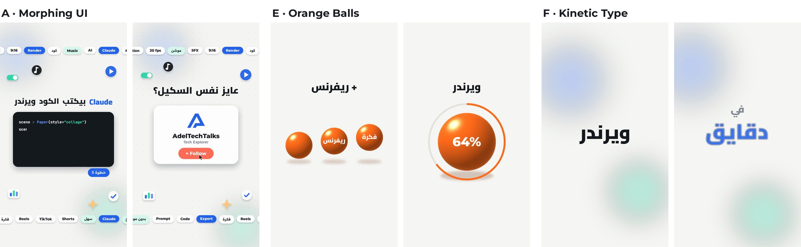

<p align="center"><a href="README.md"></a>&nbsp;&nbsp;<a href="README.ar.md"></a></p>

<div align="center">



<p dir="rtl"><a href="../../../README.ar.md">→ كل الـ Skills</a> · <a href="../README.ar.md">Production</a></p>

<br>

<a href="https://github.com/adeltechtalks/AdelTechTalks-Claude/raw/main/downloads/adeltechtalks-motion-templates.zip"></a>

</div>

<div dir="rtl">

<br>

> 🧪 **تجريبية.** شغالة من أولها لآخرها، جرّبها وقولنا لو حاجة باظت. معمولة بالـ Brand بتاع AdelTechTalks ([`references/brand-tokens.md`](references/brand-tokens.md))، ولو عايزها بتاعتك غيّر الألوان واللوجو اللي في `assets/`.

| بتدّيه | بتاخد | الستايلات | شغالة على |
|:--|:--|:-:|:--|
| قصة أو Script قصير، ولو حابب صور أو Result clip | ريل 9:16 جاهز، ومعاه SFX ومزيكا 128 BPM أصلية | **3** و 5 إضافية | Claude.ai و Claude Code |

---

## بتشتغل إزاي

</div>


<div dir="rtl">

---

## التلات ستايلات

</div>



<div dir="rtl">

| الكود | الستايل | ينفع مع |
|:-:|:--|:--|
| **A** ⭐ | **Morphing UI**: شكل واحد بيتحوّل من Chat لملفات لكود لموبايل، وحواليه Chips عشان مفيش Frame فاضي | شرح الأدوات والـ Features |
| **E** | **Orange Balls**: كورة بتنزل وتتقسم وتشيل كلام، وفي الآخر تبقى موبايل | قصص فيها أرقام، والـ Reviews |
| **F** | **Kinetic Type**: جملة على كل نص Bar بـ 128 BPM، بأشكال مختلفة | الأخبار اليومية والـ Hooks |

ستايلات إضافية جاهزة: Paper Collage و Liquid Glass و Isometric 3D و Shape Morph و Editorial Depth (`templates/extras/`).

---

## ابدأ

### 1 · Install: مرة واحدة، 5 دقايق

</div>

<a href="https://github.com/adeltechtalks/AdelTechTalks-Claude/raw/main/downloads/adeltechtalks-motion-templates.zip"></a>

<div dir="rtl">

<sub>دوس على الصورة عشان تحمّل · Settings → Capabilities → **Code execution and file creation** · Customize → Skills → **+** → ارفع الـ ZIP زي ما هو.</sub>

### 2 · اطلب الريل

</div>

```
استخدم adeltechtalks-motion-templates.
اعملي ريل بستايل A عن: [القصة في 3 لـ 5 سطور].
وريني Test frames الأول.
```

<div dir="rtl">

Claude بيعدّل الكلام في الـ Template، ويوريك Test frames، وبعدين يعمل الريل بالـ SFX والمزيكا.

### 3 · أو شغّلها بنفسك (Claude Code أو الـ Terminal)

</div>

```bash
pip install -r requirements.txt     # و ffmpeg
bash engine/fetch_fonts.sh          # مرة واحدة
python render.py --style a --out output/
```

<div dir="rtl">

| الـ Folder | بيتحط فيه إيه |
|:--|:--|
| `input/photo.jpg` | صورة شخصية للـ Avatar أو الـ Collage |
| `input/result/*.png` | Frames الـ Result clip اللي بيظهر جوه الموبايل |
| `input/partner_1.png` · `partner_2.png` · `flag_1.jpg` · `flag_2.png` | لوجوهات الـ Partners والـ Badges (للإضافية بس) |
| `work/` · `output/` | الـ Test frames والملفات المؤقتة · الفيديوهات الجاهزة |

أي حاجة ناقصة في `input/` بيترسم مكانها Placeholder مكتوب عليه اسمها، والـ Console بيقولك تضيف إيه. و `input/` و `work/` و `output/` والفونتات مش بيترفعوا على GitHub.

---

<details>
<summary><b>القواعد اللي الـ Templates ماشية عليها</b></summary>

<br>

- الكلام على الشاشة بالمصري، والكلمات التقنية الإنجليزي تفضل إنجليزي.
- كل حاجة بتتقري جوه الـ 4:5 اللي في النص (y من 285 لـ 1635 على 1080×1920)، فبتنفع على كل المنصات.
- مفيش Frame فاضي، والإيقاع سريع على الـ Beat، و Bar تحضير قبل ما النتيجة تظهر.
- الـ Spark Coral بيظهر مرة واحدة بس، على الـ CTA.
- أي رقم أو Claim على الشاشة لازم يكون منك أو من مصدر موثوق.

</details>

<details>
<summary><b>لو حصلت مشكلة</b></summary>

<br>

| المشكلة | الحل |
|:--|:--|
| `ffmpeg not found` | سطّب ffmpeg، أو شغّل بـ `FFMPEG=/path/to/ffmpeg` |
| الحروف العربي طالعة مفكّكة | Pillow محتاج libraqm |
| فيه مربع مكتوب عليه `photo.jpg` أو `result 1/24` | الملف ده ناقص، ضيفه في `input/` |
| المزيكا بتضرب بدري أو متأخر | `python render.py --style a --drop 19.3 --end 27` |

</details>

---

<sub>Built by <b><a href="https://instagram.com/adeltechtalks">@AdelTechTalks</a></b> · الفونتات: Cairo و Readex Pro و Montserrat و JetBrains Mono (SIL OFL، بتتحمّل وقت الـ Setup) · كل الـ SFX والمزيكا معمولين بالكود · <a href="../../../LICENSE">MIT License</a></sub>

</div>
