<p align="center"><a href="README.md"></a>&nbsp;&nbsp;<a href="README.ar.md"></a></p>

<div align="center">


[← All skills](../../../README.md) · [Production](../)

<br>

<a href="https://github.com/adeltechtalks/AdelTechTalks-Claude/raw/main/downloads/adeltechtalks-motion-templates.zip"></a>

</div>

<br>

> [!NOTE]
> 🧪 **Testing.** Works end to end — try it and tell us what breaks. It uses the AdelTechTalks brand ([`references/brand-tokens.md`](references/brand-tokens.md)); swap the tokens and the logo in `assets/` to make it yours.

| You give | You get | Styles | Works in |
|:--|:--|:-:|:--|
| A short story or script — plus optional photos or a result clip | A finished 9:16 reel with original SFX and 128 BPM music | **3** + 5 extras | Claude.ai · Claude Code |

---

## How it works


---

## The 3 styles


| Code | Style | Best for |
|:-:|:--|:--|
| **A** ⭐ | **Morphing UI** — one shape morphs chat → files → code → phone, with ambient chips so no frame is empty | Tool and feature explainers |
| **E** | **Orange Balls** — a glossy ball drops, splits, carries labels and becomes a phone | Stories with numbers, reviews |
| **F** | **Kinetic Type** — one phrase per half-bar at 128 BPM, varied layouts | Daily news and hooks |

Extras, ready to use: Paper Collage, Liquid Glass, Isometric 3D, Shape Morph, Editorial Depth (`templates/extras/`).

---

## Get started

### 1 · Install — once, 5 minutes

<a href="https://github.com/adeltechtalks/AdelTechTalks-Claude/raw/main/downloads/adeltechtalks-motion-templates.zip"></a>

<sub>Tap the image to download · Settings → Capabilities → **Code execution and file creation** · Customize → Skills → **+** → upload the ZIP as it is.</sub>

### 2 · Ask for a reel

```
Use adeltechtalks-motion-templates.
Make a reel in style A about: [your story in 3–5 lines].
Show me test frames first.
```

Claude edits the template text, shows you test frames, then renders the reel with SFX and music.

### 3 · Or run it yourself (Claude Code / terminal)

```bash
pip install -r requirements.txt     # plus ffmpeg
bash engine/fetch_fonts.sh          # once
python render.py --style a --out output/
```

| Folder | What goes there |
|:--|:--|
| `input/photo.jpg` | Portrait for the avatar / collage |
| `input/result/*.png` | Frames of the result clip shown in the phone |
| `input/partner_1.png` · `partner_2.png` · `flag_1.jpg` · `flag_2.png` | Partner logos and badges (extras only) |
| `work/` · `output/` | Test frames and intermediate files · finished videos |

Anything missing in `input/` is drawn as a labelled placeholder, and the console tells you what to add. `input/`, `work/`, `output/` and the fonts are git-ignored.

---

<details>
<summary><b>Rules the templates follow</b></summary>

<br>

- On-screen text in Egyptian Arabic; English tech terms stay English.
- Everything readable sits in the centre 4:5 crop (y 285–1635 on 1080×1920), so it works on every platform.
- No empty frames, fast pacing on the beat, one build bar before the result reveal.
- Spark Coral appears once — on the CTA.
- Numbers and claims on screen come from you or a verified source.

</details>

<details>
<summary><b>Troubleshooting</b></summary>

<br>

| Problem | Fix |
|:--|:--|
| `ffmpeg not found` | Install ffmpeg, or run with `FFMPEG=/path/to/ffmpeg` |
| Arabic letters come out disconnected | Pillow needs libraqm (`pip install pillow` on a system with libraqm) |
| A box says `photo.jpg` or `result 1/24` | That input is missing — add it to `input/` |
| Music hits too early or late | `python render.py --style a --drop 19.3 --end 27` |

</details>

---

<sub>Built by <b><a href="https://instagram.com/adeltechtalks">@AdelTechTalks</a></b> · Fonts: Cairo, Readex Pro, Montserrat, JetBrains Mono (SIL OFL, downloaded at setup) · All SFX and music are synthesized in code · Released under the <a href="../../../LICENSE">MIT License</a></sub>
