<p align="center"><a href="README.md"></a>&nbsp;&nbsp;<a href="README.ar.md"></a></p>

<div align="center">


<p dir="rtl"><a href="../../../README.ar.md">→ كل الـ Skills</a> · <a href="../README.ar.md">Production</a></p>

<br>

<a href="https://github.com/adeltechtalks/AdelTechTalks-Claude/raw/main/downloads/motion-templates.zip"></a>

</div>

<div dir="rtl">

<br>

> 🧪 **تجريبية.** شغالة من أولها لآخرها، جرّبها وقولنا لو حاجة باظت.

| بتدّيه | بتاخد | الستايلات | شغالة على |
|:--|:--|:-:|:--|
| قصة أو Script قصير، ولو حابب صور أو Result clip | ريل 9:16 جاهز، ومعاه SFX ومزيكا 128 BPM أصلية | **3** و 5 إضافية | Claude.ai و Claude Code |

---

## بتشتغل إزاي

</div>



<div dir="rtl">

---

## بالـ Brand بتاعك، مش بتاعنا

الـ Templates اتصممت بالـ Brand بتاع AdelTechTalks، وده موجود كمثال بس. أول مرة تستخدم الـ Skill، Claude هيسألك عن **اسمك وألوانك والفونتات واللوجو والكلام اللي في آخر الفيديو**، ويحفظهم في `brand.json`، وكل فيديو يطلع بالستايل بتاعك.

</div>


<div dir="rtl">

---

## السبع ستايلات

</div>


<div dir="rtl">

| الكود | الستايل | ينفع مع |
|:-:|:--|:--|
| **A** ⭐ | **Morphing UI**: شكل واحد بيتحوّل من Chat لملفات لكود لموبايل، وحواليه Chips عشان مفيش Frame فاضي | شرح الأدوات والـ Features |
| **E** | **Orange Balls**: كورة بتنزل وتتقسم وتشيل كلام، وفي الآخر تبقى موبايل | قصص فيها أرقام، والـ Reviews |
| **F** | **Kinetic Type**: جملة على كل نص Bar بـ 128 BPM، بأشكال مختلفة | الأخبار اليومية والـ Hooks |
| **G** | **Editorial Poster**: صور مقصوصة أبيض وأسود على دايرة بلون الـ Brand، وكلمة ضخمة بتعدّي من وراها، والكلام بيدخل كلمة كلمة، و Cuts على الـ Bar. مش محتاجة صور، هي بتجيبها | الأفكار والآراء والـ Quotes |
| **H** | **Studio Stage**: أوبجكتس حقيقية على ستوديو أرضيته بلون الـ Brand، و Whip transitions، ومدارات، وكروت 3D بضل طويل. مش محتاجة صور، هي بتجيبها | الشرح وقصص «ليه الحاجة دي بتنجح» |
| **I** | **Doc Collage**: مونتاج وثائقي، كلام بيخبط ويلف، والدنيا بتبقى أبيض وأسود، وسنة بتعدّ، وصورة مقطوعة على خشب، وكلام بيتردد، وشمس بتتحول ساعة. وفوقها Film grain | قصص البيزنس و«اليوم اللي قالوا فيه لأ» |
| **J** | **Edit Compare**: الفيديو بتاعك وإنت بتتكلم في كارتين جنب بعض: «$5 Edit» خام، و«$100 Edit» فيه Punch-ins و B-roll بعناوين و Captions كلمة كلمة. وصوتك هو اللي بيقود الصوت | تعرض شغلك في المونتاج، قبل وبعد |

<sub>صور ستايل G الـ Skill لقتها بنفسها: الخوذة “Astronaut Helmet” لـ Sam Howzit (CC BY 2.0)، ومجسّم المخ من rawpixel (CC0). ستايل H: التلفزيون لـ France1978 (CC BY-SA 2.0)، والخاتم لـ Gnilenkov Aleksey (CC BY 2.0)، واللمبة من rawpixel (CC0)، وقطعة الشطرنج لـ poppet with a camera (CC BY 2.0). ستايل I و J: التلال لـ • Sawtooth • (CC BY-SA 2.0)، والكرسي لـ John Beans (CC BY 2.0)، والمدينة لـ Maëlick (CC BY-SA 2.0)، والخشب لـ texturepalace (CC BY-SA 2.0)، والمايك من rawpixel (CC0).</sub>

ستايلات إضافية جاهزة: Paper Collage و Liquid Glass و Isometric 3D و Shape Morph و Editorial Depth (`templates/extras/`).

---

## ابدأ

### 1 · Install: مرة واحدة، 5 دقايق

</div>

<a href="https://github.com/adeltechtalks/AdelTechTalks-Claude/raw/main/downloads/motion-templates.zip"></a>

<div dir="rtl">

<sub>دوس على الصورة عشان تحمّل · Settings → Capabilities → **Code execution and file creation** · Customize → Skills → **+** → ارفع الـ ZIP زي ما هو.</sub>

### 2 · الـ Brand بتاعك: مرة واحدة

</div>

```
استخدم motion-templates. ظبطلي الـ Brand بتاعي الأول.
```

<div dir="rtl">

Claude هيسألك عن الاسم والـ Tagline، والألوان، والفونتات، واللوجو (PNG خلفيته شفافة)، والكلام اللي في آخر الفيديو، وبعدين يحفظ `input/brand.json` و `input/logo.png`. احتفظ بيهم، وابعتهم تاني المرة الجاية أو حطهم في Project.

### 3 · اطلب الريل

</div>

```
استخدم motion-templates.
اعملي ريل بستايل A عن: [القصة في 3 لـ 5 سطور].
وريني Test frames الأول.
```

<div dir="rtl">

Claude بيعدّل الكلام في الـ Template، ويوريك Test frames، وبعدين يعمل الريل بالـ SFX والمزيكا.

### 4 · أو شغّلها بنفسك (Claude Code أو الـ Terminal)

</div>

```bash
pip install -r requirements.txt     # و ffmpeg
bash engine/fetch_fonts.sh          # مرة واحدة
cp brand.template.json input/brand.json   # املاه بالـ Brand بتاعك، وحط input/logo.png
python render.py --style a --out output/
```

<div dir="rtl">

| الـ Folder | بيتحط فيه إيه |
|:--|:--|
| `input/brand.json` · `input/logo.png` | الـ Brand بتاعك (من الخطوة 2 أو من `brand.template.json`) |
| `input/photo.jpg` | صورة شخصية للـ Avatar أو الـ Collage |
| `input/result/*.png` | Frames الـ Result clip اللي بيظهر جوه الموبايل |
| `input/partner_1.png` · `partner_2.png` · `flag_1.jpg` · `flag_2.png` | لوجوهات الـ Partners والـ Badges (للإضافية بس) |
| `work/` · `output/` | الـ Test frames والملفات المؤقتة · الفيديوهات الجاهزة |

أي حاجة ناقصة في `input/` بيترسم مكانها Placeholder مكتوب عليه اسمها، والـ Console بيقولك تضيف إيه. و `input/` و `work/` و `output/` والفونتات مش بيترفعوا على GitHub.

---

</div>

<div dir="rtl">

## علّمها Motion جديد

شفت Motion عاجبك؟ ابعته لـ Claude (Video أو GIF أو Screenshots أو حتى وصف) وقوله الجزء اللي عاجبك. الـ Skill بتتعلمه كـ Move تقدر تستخدمه تاني، بالـ Brand بتاعك.

</div>


<div dir="rtl">

| 1 · ابعت | 2 · تحليل | 3 · بناء | 4 · موافقة | 5 · حفظ |
|:--|:--|:--|:--|:--|
| الـ Clip + «عاجبني دخول العنوان في ثانية 3» | `engine/study.py` بيقسمه Frames و Motion graph | Claude بيكتب الـ Motion DNA و Move جديد في `engine/moves.py` | Preview من `templates/lab/moves_demo.py`، ونعدّل لحد ما يظبط | بيتسجل في [`references/motion-library.md`](references/motion-library.md) وجاهز لأي Template |

<sub>بنتعلم الحركة بس، مش الـ Brand ولا الفيديو ولا اللوجوهات ولا المزيكا بتاعة المصدر. اللي اتغير: [CHANGELOG.md](CHANGELOG.md).</sub>

---

</div>

<div dir="rtl">

## أصوات بتتغير في كل فيديو

كل ريل بياخد مجموعة SFX خاصة بيه، عشان فيديوهاتك متبقاش كلها نفس الـ Clicks ونفس الـ Whooshes. الـ Skill جاية ومعاها 17 صوت CC0، وبتتعلم أصوات جديدة:

| تكبّر المكتبة | الأمر |
|:--|:--|
| من ريل عاجبك: بتطلّع الـ Clicks والـ Hits والـ Whooshes اللي على الـ Cuts (مش المزيكا) | `python engine/sfx_library.py harvest reel.mp4` |
| أصوات CC0 و CC BY مجانية، والـ Credits محفوظة | `python engine/sfx_library.py download "whoosh"` |
| الـ SFX Pack بتاعك | `python engine/sfx_library.py import ~/my-sfx/` |
| تسمع وتنضّف | `sheet` ← `audition.wav` · `remove <id>` |
| نفس الصورة بأصوات جديدة | `python render.py --style h --audio-only` |

<sub>الأصوات اللي بتطلع من ريلز ناس تانية بتفضل في المكتبة اللي على جهازك، لاستخدامك إنت بس، وعمرها ما بتترفع أو تتشحن مع الـ Skill.</sub>

---

</div>

<div dir="rtl">

## مفيش صور؟ هي بتدوّر

ادّيها القصة بس. لكل مشهد Claude بيدوّر في مكتبات صور مجانية ومسموح استخدامها، ويختار أحسن صورة، ويقص الـ Subject، ويخليها أبيض وأسود لو الستايل محتاج كده، ويحفظلك الـ Credits عشان الـ Caption.

</div>


<div dir="rtl">

<sub>الخوذة: “Astronaut Helmet” لـ Sam Howzit، CC BY 2.0 · الأرض: NASA، Public domain. الـ Skill هي اللي لقتهم وسجّلت الـ Credits.</sub>

| بتدوّر فين | محتاجة Key؟ |
|:--|:--|
| Openverse (CC0 / CC BY / CC BY-SA) · Wikimedia Commons · NASA | لأ |
| Pexels · Pixabay · Unsplash | API key مجاني |

<sub>عمرها ما بتستخدم لقطات أفلام أو مشاهير أو لوجوهات Brands أو أي حاجة من فيديو المرجع، بس الصور المسموح بيها. جرّب: `python engine/assets.py search "astronaut helmet"`.</sub>

---

<details>
<summary><b>القواعد اللي الـ Templates ماشية عليها</b></summary>

<br>

- الكلام على الشاشة بالمصري، والكلمات التقنية الإنجليزي تفضل إنجليزي.
- كل حاجة بتتقري جوه الـ 4:5 اللي في النص (y من 285 لـ 1635 على 1080×1920)، فبتنفع على كل المنصات.
- مفيش Frame فاضي، والإيقاع سريع على الـ Beat، و Bar تحضير قبل ما النتيجة تظهر.
- لون الـ CTA بتاعك بيظهر مرة واحدة بس، على زرار الـ Follow.
- أي رقم أو Claim على الشاشة لازم يكون منك أو من مصدر موثوق.

</details>

<details>
<summary><b>لو حصلت مشكلة</b></summary>

<br>

| المشكلة | الحل |
|:--|:--|
| `ffmpeg not found` | سطّب ffmpeg، أو شغّل بـ `FFMPEG=/path/to/ffmpeg` |
| الحروف العربي طالعة مفكّكة | Pillow محتاج libraqm |
| فيه مربع مكتوب عليه `photo.jpg` أو `result 1/24` | الملف ده ناقص، ضيفه في `input/` |
| الفيديو طالع باسم AdelTechTalks | لسه مفيش `input/brand.json`، ظبط الـ Brand بتاعك (الخطوة 2) |
| المزيكا بتضرب بدري أو متأخر | `python render.py --style a --drop 19.3 --end 27` |

</details>

---

<sub>Built by <b><a href="https://instagram.com/adeltechtalks">@AdelTechTalks</a></b> · الـ Brand المثال في <code>examples/adeltechtalks/</code> · الفونتات: Cairo و Readex Pro و Montserrat و JetBrains Mono (SIL OFL، بتتحمّل وقت الـ Setup) · كل الـ SFX والمزيكا معمولين بالكود · <a href="../../../LICENSE">MIT License</a></sub>

</div>
