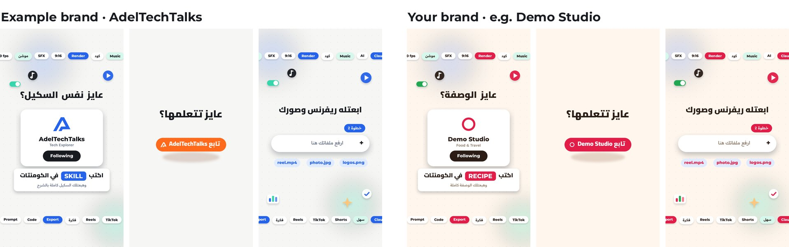
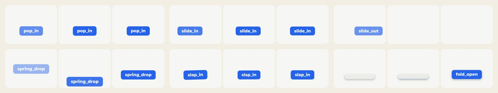
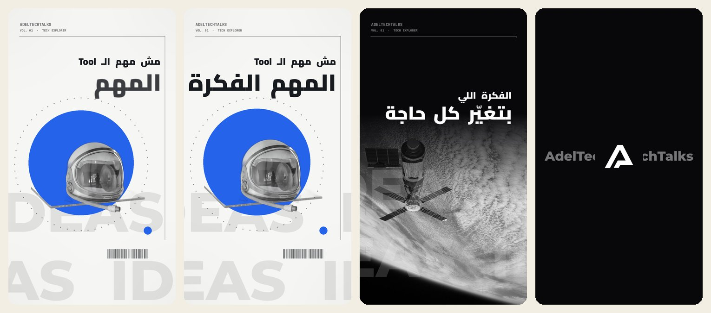

<p align="center"><a href="README.md"></a>&nbsp;&nbsp;<a href="README.ar.md"></a></p>

<div align="center">



[← All skills](../../../README.md) · [Production](../)

<br>

<a href="https://github.com/adeltechtalks/AdelTechTalks-Claude/raw/main/downloads/motion-templates.zip"></a>

</div>

<br>

> [!NOTE]
> 🧪 **Testing.** Works end to end — try it and tell us what breaks.

| You give | You get | Styles | Works in |
|:--|:--|:-:|:--|
| A short story or script — plus optional photos or a result clip | A finished 9:16 reel with original SFX and 128 BPM music | **3** + 5 extras | Claude.ai · Claude Code |

---

## How it works



---

## Your brand, not ours

The templates were designed with the AdelTechTalks brand, which ships only as an example. The first time you use the Skill, Claude asks for **your** name, colours, fonts, logo and ending text, saves them as `brand.json`, and every video comes out in your style.



---

## The 3 styles


| Code | Style | Best for |
|:-:|:--|:--|
| **A** ⭐ | **Morphing UI** — one shape morphs chat → files → code → phone, with ambient chips so no frame is empty | Tool and feature explainers |
| **E** | **Orange Balls** — a glossy ball drops, splits, carries labels and becomes a phone | Stories with numbers, reviews |
| **F** | **Kinetic Type** — one phrase per half-bar at 128 BPM, varied layouts | Daily news and hooks |

Extras, ready to use: Paper Collage, Liquid Glass, Isometric 3D, Shape Morph, Editorial Depth (`templates/extras/`).

---

## Get started

### 1 · Install — once, 5 minutes

<a href="https://github.com/adeltechtalks/AdelTechTalks-Claude/raw/main/downloads/motion-templates.zip"></a>

<sub>Tap the image to download · Settings → Capabilities → **Code execution and file creation** · Customize → Skills → **+** → upload the ZIP as it is.</sub>

### 2 · Set up your brand — once

```
Use motion-templates. Set up my brand first.
```

Claude asks for your name and tagline, colours, fonts, logo (transparent PNG) and the ending text, then saves `input/brand.json` + `input/logo.png`. Keep both — send them again next time or add them to a Project.

### 3 · Ask for a reel

```
Use motion-templates.
Make a reel in style A about: [your story in 3–5 lines].
Show me test frames first.
```

Claude edits the template text, shows you test frames, then renders the reel with SFX and music.

### 4 · Or run it yourself (Claude Code / terminal)

```bash
pip install -r requirements.txt     # plus ffmpeg
bash engine/fetch_fonts.sh          # once
cp brand.template.json input/brand.json   # fill in your brand, add input/logo.png
python render.py --style a --out output/
```

| Folder | What goes there |
|:--|:--|
| `input/brand.json` · `input/logo.png` | Your brand (from step 2 or `brand.template.json`) |
| `input/photo.jpg` | Portrait for the avatar / collage |
| `input/result/*.png` | Frames of the result clip shown in the phone |
| `input/partner_1.png` · `partner_2.png` · `flag_1.jpg` · `flag_2.png` | Partner logos and badges (extras only) |
| `work/` · `output/` | Test frames and intermediate files · finished videos |

Anything missing in `input/` is drawn as a labelled placeholder, and the console tells you what to add. `input/`, `work/`, `output/` and the fonts are git-ignored.

## Teach it a new motion

Saw a motion you love? Send it to Claude — a video, GIF, screenshots or just a description — and say which part you like. The skill learns it as a reusable move, in your brand.



| 1 · Send | 2 · Study | 3 · Build | 4 · Approve | 5 · Keep |
|:--|:--|:--|:--|:--|
| The clip + "I like how the title lands at 0:03" | `engine/study.py` splits it into frames + a motion graph | Claude writes the Motion DNA and a new move in `engine/moves.py` | A preview from `templates/lab/moves_demo.py` — tweak until it's right | Logged in [`references/motion-library.md`](references/motion-library.md), ready for any template |

<sub>Only the motion is learned — never the reference's brand, footage, logos or music. What changed: [CHANGELOG.md](CHANGELOG.md).</sub>

## No images? It finds them

Give it just the story. For each scene Claude searches free, licence-safe libraries, picks the best image, cuts out the subject, makes it black & white if the look needs it — and keeps the credits for your caption.



<sub>Helmet: “Astronaut Helmet” by Sam Howzit, CC BY 2.0 · Earth: NASA, public domain — found and credited by the skill.</sub>

| Where it looks | Key needed? |
|:--|:--|
| Openverse (CC0 / CC BY / CC BY-SA) · Wikimedia Commons · NASA | No |
| Pexels · Pixabay · Unsplash | A free API key |

<sub>Never film stills, celebrities, brand logos or anything copied from a reference — only images it's allowed to use. Try it: `python engine/assets.py search "astronaut helmet"`.</sub>

---

<details>
<summary><b>Rules the templates follow</b></summary>

<br>

- On-screen text in Egyptian Arabic; English tech terms stay English.
- Everything readable sits in the centre 4:5 crop (y 285–1635 on 1080×1920), so it works on every platform.
- No empty frames, fast pacing on the beat, one build bar before the result reveal.
- Your CTA colour appears once — on the follow button.
- Numbers and claims on screen come from you or a verified source.

</details>

<details>
<summary><b>Troubleshooting</b></summary>

<br>

| Problem | Fix |
|:--|:--|
| `ffmpeg not found` | Install ffmpeg, or run with `FFMPEG=/path/to/ffmpeg` |
| Arabic letters come out disconnected | Pillow needs libraqm (`pip install pillow` on a system with libraqm) |
| A box says `photo.jpg` or `result 1/24` | That input is missing — add it to `input/` |
| The video shows AdelTechTalks | No `input/brand.json` yet — set up your brand (step 2) |
| Music hits too early or late | `python render.py --style a --drop 19.3 --end 27` |

</details>

---

<sub>Built by <b><a href="https://instagram.com/adeltechtalks">@AdelTechTalks</a></b> · Example brand in <code>examples/adeltechtalks/</code> · Fonts: Cairo, Readex Pro, Montserrat, JetBrains Mono (SIL OFL, downloaded at setup) · All SFX and music are synthesized in code · Released under the <a href="../../../LICENSE">MIT License</a></sub>
