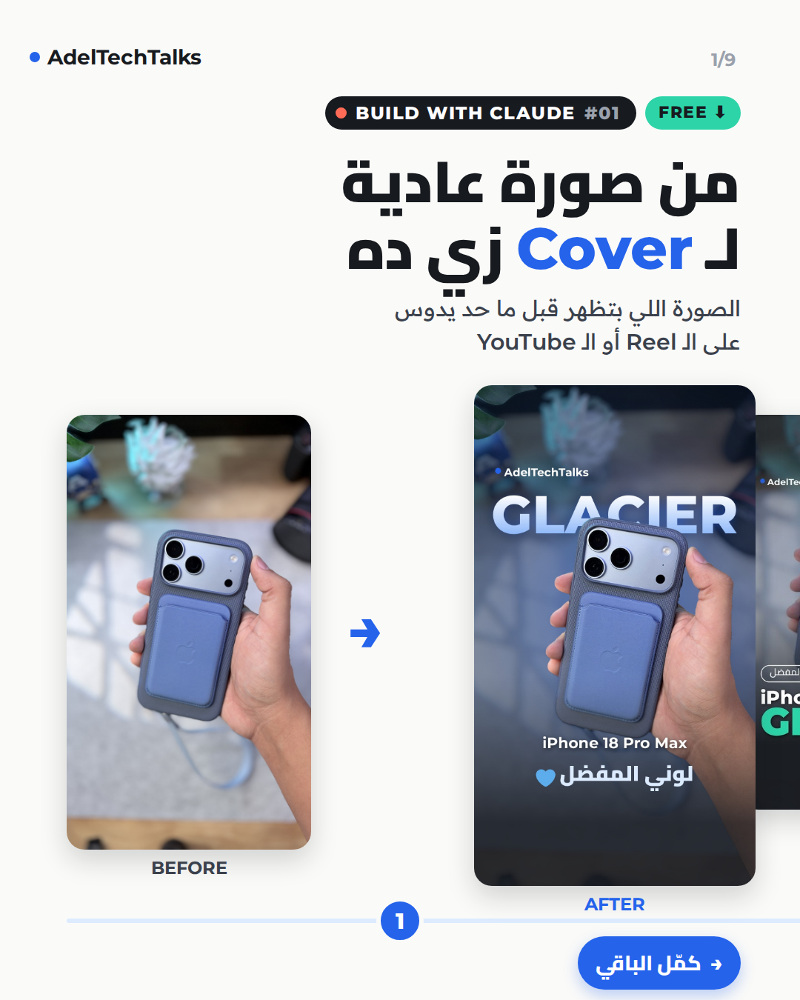
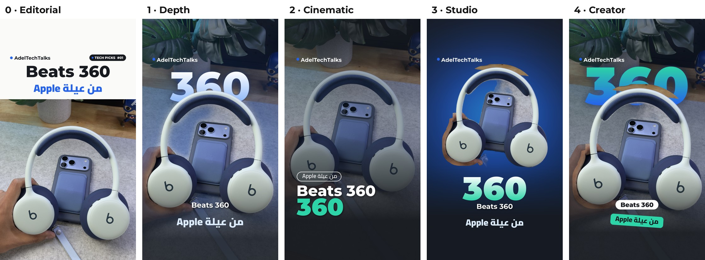

# Social Cover Studio 🎨

[← All skills](../../../README.md) · [Publish & Grow](../) · **English** · [العربية](README.ar.md)

`Stage: Publish & Grow` `Step 11 · Package & Publish` `Free`

A Claude Skill that turns a single photo into **branded covers and thumbnails** — in your colours and fonts, exported for every platform: Instagram, TikTok, Facebook and YouTube.



<p align="center">
  <a href="https://github.com/adeltechtalks/att-claude-creator-skills/raw/main/downloads/social-cover-studio.zip"><b>⬇ Download social-cover-studio.zip</b></a>
  &nbsp;·&nbsp;
  <a href="../../../docs/social-cover-studio/guide.pdf">📄 Full guide (PDF, Arabic)</a>
</p>

---

## What it does

Send Claude a photo of a product — or of yourself holding it — and it will:

1. Show you **5 templates** side by side so you can pick one.
2. Apply your brand colours and fonts.
3. Export the cover in every size, with the product in its true colours.

| # | Template | Look |
|:-:|:--|:--|
| 0 | **Editorial** | Natural photo with a clean light text panel |
| 1 | **Depth** | A big word **behind** the product |
| 2 | **Cinematic** | Full-bleed film-grade photo with a two-line headline |
| 3 | **Studio** | Product cut out onto a glowing brand-colour backdrop |
| 4 | **Creator** | For photos of you — word behind your head, product stickers |



---

## Installation

1. **[Download the ZIP](https://github.com/adeltechtalks/att-claude-creator-skills/raw/main/downloads/social-cover-studio.zip).**
2. In Claude, open **Settings → Capabilities** and turn on **Code execution and file creation**.
3. Go to **Customize → Skills**, click **+**, and upload the ZIP as it is — **don't unzip it**.

---

## First use: set up your brand

Start a new chat and type:

```
Use social-cover-studio and set up my brand first.
```

Claude asks three questions — your handle, your colours (hex codes, a logo, or plain words), and your fonts from a built-in list — then gives you a **`brand.json`** file. Keep it and attach it to future chats (or add it to a Project) so every cover looks consistent.

## Make your first cover

Send the photo together with `brand.json`:

```
Make a cover for this photo:
- Big word: GLACIER
- Product: iPhone 18 Pro Max
- Keyword: my favourite colour
Show me the templates first.
```

Pick one — *"I like number 1, export all sizes"* — and you get:

| File | Size | Use it for |
|:--|:--|:--|
| `instagram-tiktok` | 1080×1920 (9:16) | Reels, TikTok, Facebook Reels |
| `facebook` | 1080×1350 (4:5) | Feed posts |
| `youtube` | 1920×1080 (16:9) | Long-form video thumbnails |

---

## Tips

- Leave some empty space above the product (or above your head for **Creator**).
- Keep the big word between 4 and 9 letters — a colour, a model name, or one word that sums up the video.
- Busy backgrounds work best with **Editorial** and **Depth**.
- Dark emoji (🖤) disappear on dark backgrounds — use light ones (✨ 🤍).

## Troubleshooting

| Problem | Fix |
|:--|:--|
| Claude doesn't use the skill | Say it explicitly: *"Use social-cover-studio"* |
| The first run in a chat is slow | Expected — it downloads the cut-out models once (1–2 minutes) |
| The upload fails | Make sure you're uploading the `.zip` file, not the unzipped folder |
| Text gets cropped in the profile grid | Use **Edit profile grid** when posting on Instagram |

---

## Credits

Built by **[@AdelTechTalks](https://instagram.com/adeltechtalks)** · rembg & pymatting (MIT) · Google Fonts (SIL OFL) · Emoji: Twemoji (CC-BY 4.0)

Released under the [MIT License](../../../LICENSE).
