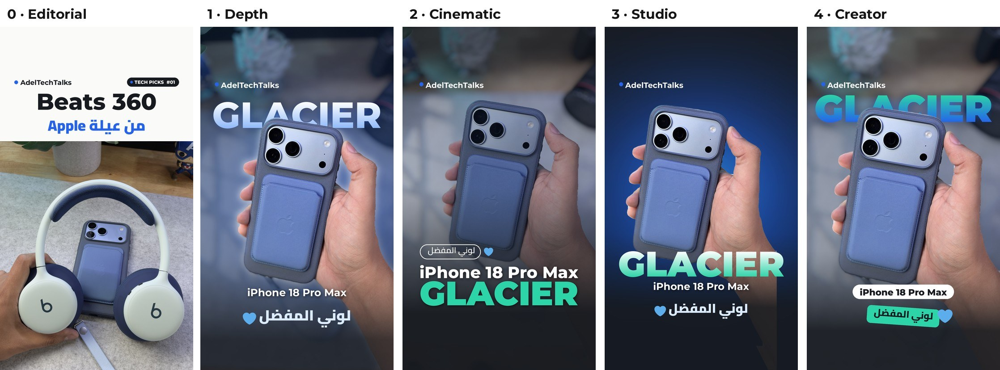

<p align="center"><a href="README.md"></a>&nbsp;&nbsp;<a href="README.ar.md"></a></p>

<div align="center">



[← All skills](../../../README.md) · [Publish & Grow](../)

<br>

<a href="https://github.com/adeltechtalks/AdelTechTalks-Claude/raw/main/downloads/social-cover-studio.zip"></a>
&nbsp;
<a href="../../../docs/social-cover-studio/guide.pdf"></a>

</div>

<br>

| You give | You get | Templates | Works in |
|:--|:--|:-:|:--|
| One photo of a product — or of you holding it | A branded cover in **9:16**, **4:5** and **16:9** | **5** | Claude.ai · Claude Code |

---

## How it works



---

## The 5 templates



| # | Template | Looks like | Best for |
|:-:|:--|:--|:--|
| 0 | **Editorial** | Natural photo under a clean light text panel | Any photo — the safe default |
| 1 | **Depth** | A big word **behind** the product | Product in hand or on a desk |
| 2 | **Cinematic** | Full-bleed film grade, two-line headline | Photos with a strong story |
| 3 | **Studio** | Product cut out on a brand-colour glow | Clean product shots |
| 4 | **Creator** | Word behind your head, product stickers | Photos of **you** with the product |

---

## Get started

### 1 · Install — once, 5 minutes

<a href="https://github.com/adeltechtalks/AdelTechTalks-Claude/raw/main/downloads/social-cover-studio.zip"></a>

<sub>Tap the image to download · Settings → Capabilities → **Code execution and file creation** · Customize → Skills → **+** → upload the ZIP as it is.</sub>

### 2 · Set up your brand — once

Start a new chat and send:

```
Use social-cover-studio and set up my brand first.
```

Claude asks for your handle, your colours (hex codes, a logo or plain words) and your fonts, then gives you **`brand.json`**. Keep it — attach it to future chats or add it to a Project so every cover looks the same.

### 3 · Make your first cover

Send the photo with `brand.json`:

```
Make a cover for this photo:
- Big word: GLACIER
- Product: iPhone 18 Pro Max
- Keyword: my favourite colour
Show me the templates first.
```

Then pick one: *"I like number 1 — export all sizes."*

| File | Size | Use it for |
|:--|:--|:--|
| `instagram-tiktok` | 1080 × 1920 · 9:16 | Reels, TikTok, Facebook Reels |
| `facebook` | 1080 × 1350 · 4:5 | Feed posts |
| `youtube` | 1920 × 1080 · 16:9 | Long-form thumbnails |

---

<details>
<summary><b>Tips for great covers</b></summary>

<br>

- Leave empty space above the product — or above your head for **Creator**.
- Keep the big word to 4–9 letters: a colour, a model name, or one word that sums up the video.
- Busy backgrounds look cleanest with **Editorial** and **Depth**.
- Dark emoji (🖤) disappear on dark backgrounds — use light ones (✨ 🤍).

</details>

<details>
<summary><b>Troubleshooting</b></summary>

<br>

| Problem | Fix |
|:--|:--|
| Claude doesn't use the skill | Say it explicitly: *"Use social-cover-studio"* |
| The first run in a chat is slow | Expected — it downloads the cut-out models once (1–2 minutes) |
| The upload fails | Upload the `.zip` file itself, not the unzipped folder |
| Text is cropped in the profile grid | Use **Edit profile grid** when posting on Instagram |

</details>

---

<sub>Built by <b><a href="https://instagram.com/adeltechtalks">@AdelTechTalks</a></b> · rembg & pymatting (MIT) · Google Fonts (SIL OFL) · Twemoji (CC-BY 4.0) · Released under the <a href="../../../LICENSE">MIT License</a></sub>
