&nbsp;&nbsp;

<a href="../README.ar.md">→ الصفحة الرئيسية</a>

# كل الـ Skills

كل الـ Skills مترتبة بمراحل الـ Content Creation OS.

✅ جاهزة للتحميل · 🧪 تجريبية، حمّلها وقولنا رأيك · ⏳ Free وجاية قريب · 🔒 Pro، جزء من [Content Creation OS Pro](../course/README.ar.md)

---

## متاحة دلوقتي

<table>
<tr>
<td width="50%" valign="top">
&nbsp;
</td>
<td width="50%" valign="top">
&nbsp;
</td>
</tr>
</table>

---

## حسب المرحلة

دوس على كارت المرحلة عشان تفتح صفحتها.

<table>
<tr>
<td width="44%" valign="top"></td>
<td valign="top">

⏳ <b>Niche Compass</b> · Free · قريباً تلاقي الـ Sweet Spot بتاعك وتطلع منه الـ Pillars والـ Positioning.  
⏳ <b>Brand Foundations</b> · Free · قريباً نوع الـ Brand، والاسم، والوعد، والـ Voice، وبداية الـ Visual Identity.  
⏳ <b>Account Security Audit</b> · Free · قريباً مراجعة أمان خطوة بخطوة للـ Email والـ Domain وكل المنصات.  
⏳ <b>Studio Profile</b> · Free · قريباً بتسجل معداتك وأماكن التصوير والـ Apps والمنصات وساعاتك، وكل الـ Skills التانية بتقرا منه.  
🔒 <b>Asset Library & License Gate</b> · Pro · قريباً شكل الـ Folders، وقواعد التسمية، ومصادر الـ Assets، وسجل الـ Licenses.

</td>
</tr>
<tr>
<td width="44%" valign="top"></td>
<td valign="top">

⏳ <b>Idea Capture</b> · Step 00 · Free · قريباً تحوّل Voice note أو Screenshot أو Link لـ Idea card واضح.  
⏳ <b>Idea Gate</b> · Step 01 · Free · قريباً أربع أسئلة وقرار Go أو Park أو Kill، ومعاه الـ Angle بتاعك.  
🔒 <b>Research & Reference</b> · Step 02 · Pro · قريباً مين عمل نفس الفكرة، إيه اللي نجح وإيه الناقص، وإزاي تعملها أحسن.  
🔒 <b>Brief Builder</b> · Step 03 · Pro · قريباً Brief في صفحة: الـ Pillar، ونوع المحتوى، والهدف، والـ AI Angle، وخطة المنصات.

</td>
</tr>
<tr>
<td width="44%" valign="top"></td>
<td valign="top">

⏳ <b>Hook & Script Writer</b> · Step 04 · Free · قريباً 3 Hooks، وهيكل Script، و CTA، بصوتك وبلهجتك.  
🔒 <b>Shot List Builder</b> · Step 05 · Pro · قريباً Shot List كاملة (A-roll و B-roll و Hero shots) على حسب نوع المحتوى.  
🔒 <b>Setup Recipe</b> · Step 06 · Pro · قريباً الكاميرا والمايك والإضاءة والمكان، من الـ Studio Profile بتاعك.

</td>
</tr>
<tr>
<td width="44%" valign="top"></td>
<td valign="top">

🧪 <a href="03-production/motion-templates/README.ar.md"><b>Motion Templates</b></a> · Step 09 · Free · تجريبية ريلز Motion graphics (9:16) معمولة بالكود بالـ Brand بتاعك: 5 ستايلات، و SFX ومزيكا أصلية، وأمر واحد يطلّعلك mp4 جاهز.  
🔒 <b>Footage Ingest</b> · Step 08 · Pro · قريباً Project folder وتسمية الملفات والـ Backup من كل الأجهزة.  
🔒 <b>Edit Plan</b> · Step 09 · Pro · قريباً Editor brief لقطة بلقطة: القص، والكلام على الشاشة، والـ Motion، والـ SFX، والـ B-roll.  
⏳ <b>Captions</b> · Step 09 · Free · قريباً Captions و Subtitles مظبوطة بأي لغة.

</td>
</tr>
<tr>
<td width="44%" valign="top"></td>
<td valign="top">

⏳ <b>Publish Gate</b> · Step 10 · Free · قريباً مراجعة قبل النشر: الـ Links، والـ Disclosure، والـ Safe zone، والـ Licenses.  
✅ <a href="04-publish-grow/social-cover-studio/README.ar.md"><b>Social Cover Studio</b></a> · Step 11 · Free · جاهزة Covers و Thumbnails بالـ Brand بتاعك من صورة واحدة، بكل المقاسات.  
🔒 <b>Package & Publish</b> · Step 11 · Pro · قريباً Caption و Hashtags ومواعيد لكل منصة من نفس الـ Brief.  
🔒 <b>Engage Inbox</b> · Step 12 · Pro · قريباً يلم الأسئلة المتكررة من الكومنتات والـ DMs ويحوّلها أفكار.  
🔒 <b>Analyze & Monthly Review</b> · Step 13 · Pro · قريباً أرقام يوم 1 و 7 و 30، ودرس واحد لكل Post، ومراجعة شهرية.

</td>
</tr>
<tr>
<td width="44%" valign="top"></td>
<td valign="top">

⏳ <b>Fast Track</b> · Free · قريباً خبر أو Launch يتنشر خلال 48 ساعة من غير ما يبوّظ أسبوعك.  
🔒 <b>AI Lane</b> · Pro · قريباً الـ AI بيدوّر ويكتب ويصمم، وإنت تراجع وتوافق.  
🔒 <b>Event Lane</b> · Pro · قريباً تغطية المؤتمرات والـ Events في دقايق.

</td>
</tr>
<tr>
<td width="44%" valign="top"></td>
<td valign="top">

⏳ <b>Affiliate Tracker</b> · Free · قريباً تتابع الـ Links والكليكات والأرباح لكل منتج وPost.  
🔒 <b>Media Kit</b> · Pro · قريباً Media kit احترافي من أرقامك الحقيقية.  
🔒 <b>Brand Deal Desk</b> · Pro · قريباً تقيّم الـ Brand deals وتسعّرها وترد عليها، وتكشف الـ Scams.

</td>
</tr>
</table>

