&nbsp;&nbsp;

[← Home](../README.md)

# All skills

Every skill, grouped by stage of the Content Creation OS.

✅ Ready to download · 🧪 Testing, download and send feedback · ⏳ Free, coming soon · 🔒 Pro, part of [Content Creation OS Pro](../course/)

---

## Available now

<table>
<tr>
<td width="50%" valign="top">
&nbsp;
</td>
<td width="50%" valign="top">
&nbsp;
</td>
</tr>
<tr>
<td width="50%" valign="top">
&nbsp;
</td>
<td width="50%" valign="top">

</td>
</tr>
</table>

---

## By stage

Tap a stage card to open its page.

<table>
<tr>
<td width="44%" valign="top"></td>
<td valign="top">

🧪 <a href="00-foundations/niche-compass/"><b>Niche Compass</b></a> · Free · Testing A 6-round interview that turns “I feel lost” into a One Pager: positioning, 3 pillars, an idea filter, a money plan and bios.  
⏳ <b>Brand Foundations</b> · Free · Soon Brand type, name check, promise, voice and a starter visual identity.  
⏳ <b>Account Security Audit</b> · Free · Soon Step-by-step security check for your email, domain and every platform.  
⏳ <b>Studio Profile</b> · Free · Soon Capture your gear, locations, apps, platforms and weekly hours — the profile every other skill reads.  
🔒 <b>Asset Library & License Gate</b> · Pro · Soon Folder tree, naming rules, asset sources and a license log so nothing gets muted or claimed.

</td>
</tr>
<tr>
<td width="44%" valign="top"></td>
<td valign="top">

⏳ <b>Idea Capture</b> · Step 00 · Free · Soon Turn a voice note, screenshot or link into a clean idea card.  
⏳ <b>Idea Gate</b> · Step 01 · Free · Soon Four questions — niche, need, payoff, timing — and a Go / Park / Kill decision with your angle.  
🔒 <b>Research & Reference</b> · Step 02 · Pro · Soon Find who already made it, what worked, what's missing — and how yours will be better.  
🔒 <b>Brief Builder</b> · Step 03 · Pro · Soon One-page brief: pillar, content type, goal, AI angle and channel plan.

</td>
</tr>
<tr>
<td width="44%" valign="top"></td>
<td valign="top">

⏳ <b>Hook & Script Writer</b> · Step 04 · Free · Soon Three hooks, a script structure and a CTA — in your own voice and dialect.  
🔒 <b>Shot List Builder</b> · Step 05 · Pro · Soon A-roll, B-roll and hero shots generated from the content type.  
🔒 <b>Setup Recipe</b> · Step 06 · Pro · Soon Camera, mic, lighting and location picked from your Studio Profile.

</td>
</tr>
<tr>
<td width="44%" valign="top"></td>
<td valign="top">

🧪 <a href="03-production/motion-templates/"><b>Motion Templates</b></a> · Step 09 · Free · Testing Motion-graphics reels (9:16) rendered from code in your own brand — 5 locked styles, original SFX and music, one command to a finished mp4.  
🔒 <b>Footage Ingest</b> · Step 08 · Pro · Soon Project folder, file naming and backup checklist from every device.  
🔒 <b>Edit Plan</b> · Step 09 · Pro · Soon A beat-by-beat editor brief: cuts, on-screen text, motion, SFX and B-roll.  
⏳ <b>Captions</b> · Step 09 · Free · Soon Clean, correctly shaped captions and subtitles in any language.

</td>
</tr>
<tr>
<td width="44%" valign="top"></td>
<td valign="top">

⏳ <b>Publish Gate</b> · Step 10 · Free · Soon Pre-publish check: links, disclosure, safe zones and licenses.  
✅ <a href="04-publish-grow/social-cover-studio/"><b>Social Cover Studio</b></a> · Step 11 · Free · Ready Branded covers and thumbnails from a single photo, exported for every platform.  
🔒 <b>Package & Publish</b> · Step 11 · Pro · Soon Captions, hashtags and schedule for each platform from one brief.  
🔒 <b>Engage Inbox</b> · Step 12 · Pro · Soon Group repeated questions from comments and DMs into new ideas.  
🔒 <b>Analyze & Monthly Review</b> · Step 13 · Pro · Soon Day 1 · 7 · 30 numbers, one lesson per post and a monthly review.

</td>
</tr>
<tr>
<td width="44%" valign="top"></td>
<td valign="top">

⏳ <b>Fast Track</b> · Free · Soon Breaking news or a launch live within 48 hours — without breaking your week.  
🔒 <b>AI Lane</b> · Pro · Soon AI researches, writes and designs; you review and approve.  
🔒 <b>Event Lane</b> · Pro · Soon Conference and launch-event coverage in minutes.

</td>
</tr>
<tr>
<td width="44%" valign="top"></td>
<td valign="top">

⏳ <b>Affiliate Tracker</b> · Free · Soon Track links, clicks and earnings per product and post.  
🔒 <b>Media Kit</b> · Pro · Soon A professional media kit built from your real numbers.  
🔒 <b>Brand Deal Desk</b> · Pro · Soon Qualify, price and reply to brand deals — and spot scams.

</td>
</tr>
</table>
